<p align="center">
  
</p>

<h1 align="center">Emigration</h1>

<p align="center">
  <em>People leave the places that fail them and move toward the places that thrive.</em><br>
  A population-migration and refugee mod for Sid Meier's Civilization VII.
</p>

<p align="center">
  <a href="https://github.com/tmtmiller1/civilizationvii-emigration/releases/latest"></a>
  <a href="https://steamcommunity.com/sharedfiles/filedetails/?id=3750554030"></a>
  
  
  <a href="LICENSE"></a>
</p>

<p align="center">
  <a href="https://steamcommunity.com/sharedfiles/filedetails/?id=3750554030"><strong>Subscribe on Steam</strong></a> ·
  <a href="https://github.com/tmtmiller1/civilizationvii-emigration/releases/latest"><strong>Download</strong></a> ·
  <a href="CHANGELOG.md">Changelog</a> ·
  <a href="README.pdf">Typeset PDF</a> ·
  <a href="#system-guide-and-feature-reference">Technical reference</a>
</p>

<p align="center">
  <a href="docs/steam-screenshots/01-dashboard-network.jpg">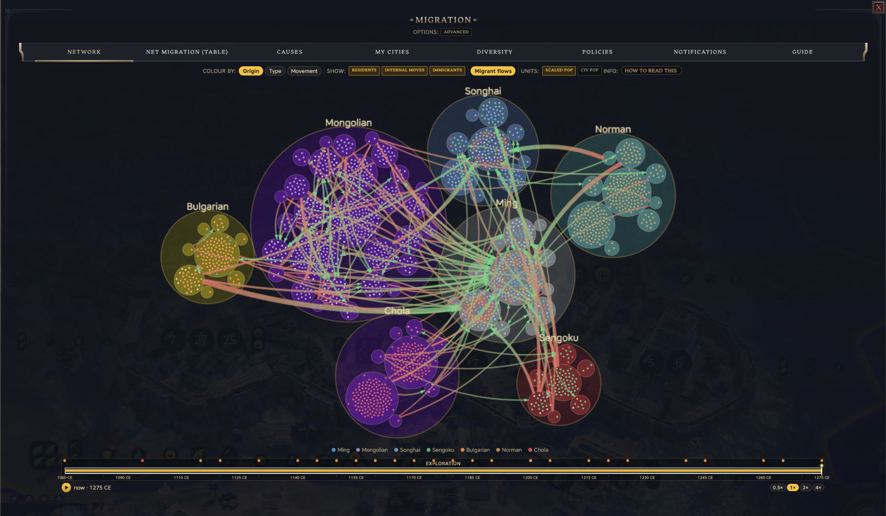</a>
</p>

When a settlement is starving, unhappy, or under siege, people leave. When one is thriving, people move there instead. *Emigration* adds migration and refugee systems to Civilization VII, moving population within and between civilizations and changing yields, growth, and Influence. Every move is logged with its cause.

Documentation on GitHub: [README.md](https://github.com/tmtmiller1/civilizationvii-emigration/blob/main/README.md) · [typeset PDF](https://github.com/tmtmiller1/civilizationvii-emigration/blob/main/README.pdf), with every formula rendered.

## What's new in 3.0.0

- **Calling your people home** is two offers: a purchase from your own settlements, and a gamble on your people abroad, each in three sizes with Gold and Influence prices.
- **Reasons to stay:** wonders and civic buildings hold people in a settlement, and emigration pressure fades once a settlement's troubles pass.
- **The Ethnic Composition lens** blends every people living on a tile, shades by how crowded it is, seats each enclave's people on its own tile, and repaints as soon as the turn starts.
- **Migrants keep who they are:** a mixed city sends out a mixed crowd, and razed settlements leave the lists at once.
- **Enclaves explain themselves:** hover an enclave's tile for its stage and the source of every yield; the map marker shows the stage.
- **The Prosperity lens** scores each tile in points and lists every term behind the score.
- **The network diagram:** click a city to see just its flows, or drag a settlement out of its civilization's circle.
- **The Civilopedia** covers the whole mod, with a page of quotations for every people.
- **The Mods tab** has a switch for each decision pop-up and full hover help on every option.

Full notes: [CHANGELOG.md](CHANGELOG.md).

## A note on the human reality behind this mod

Migration and displacement are abstracted here as game systems. In reality, people often leave home because of war, persecution, disaster, or hardship. This mod tries to acknowledge that reality without trivializing it.

I donated to the International Refugee Assistance Project while creating *Emigration*. I cannot sustain a per-subscriber pledge indefinitely, but I plan to mark major milestones with donations of time or money when I can. If you are able, please consider supporting UNHCR, the IRC, MSF, IRAP, or local refugee and mutual-aid groups.

### Subscriber milestones

- **100 subscribers:** Donated $100 to the International Refugee Assistance Project.
- **50 subscribers:** Donated $50 to Médecins Sans Frontières.
- **25 subscribers:** Donated $25 to the International Rescue Committee.
- **10 subscribers:** Pledged one hour of volunteer time to a refugee-support, humanitarian, or mutual-aid organization.
- **Release donation:** Made an initial donation to the International Refugee Assistance Project.

*Anonymized receipts will be added to the repository.*

## Features

Compatible with Civilization VII 1.5.0.

### Migration

- **Prosperity-based migration:** settlements are scored each turn on yields, happiness, war weariness, and government; population flows toward stronger settlements
- **Internal migration:** movement between a civilization's own settlements, shown separately on the dashboard
- **Cross-civilization migration:** shaped by borders, alliances, war, and asylum
- **Distance-weighted destinations:** nearby settlements are favored
- **Overcrowding pressure:** tall cities push population outward
- **Reasons to stay:** wonders and civic buildings (a granary, a market, walls, a school) hold people in a settlement, however large it is
- **Pressure that fades:** a settlement's urge to lose people follows its current situation, so a city that recovers from a siege or a bad stretch settles down again
- **Concurrent causes:** war refugees and economic migrants can leave the same city in the same turn
- **Migrant transit:** travel time scales with distance and game speed

### War and crisis

- **War refugees:** driven by district damage, sieges, and pillaging inside a city's borders
- **Aggressor-aware flight:** refugees prefer their own civilization, then neutrals, and avoid the attacker
- **Disaster and plague refugees:** floods, volcanoes, storms, and plague can force migration
- **Famine and unrest:** starvation and sustained unrest push people out
- **Crisis deaths:** prolonged siege, famine, war, or disaster can kill trapped populations
- **Displacement caps:** up to 60% of a city's population per siege and 50% per disaster
- **Resettlement time:** war and disaster refugees join the host population gradually; happy, open, uncrowded hosts settle them faster and pay upkeep while they wait
- **Refugee decisions:** rare choices to welcome refugees, settle them on the frontier, or turn them away

### Real gameplay effects

- **Real departures:** each departure removes an outlying rural improvement and its yields; pillaged tiles go first, food tiles last during famine
- **Real arrivals:** place newcomers yourself, let the city place them, or use a Migrant unit
- **Integration cost:** temporary gold cost and delayed Celebration for the host civilization
- **Congestion headwind:** limits how much one settlement can absorb

### Diplomacy and policy

- **Pro-Immigration Stance:** stronger inbound migration and more Influence
- **Anti-Immigration Stance:** stronger retention and more Production
- **Open Borders:** increases cross-civilization migration

### Identity and culture

- **Ethnic composition:** population tracked by civilization of origin, preserved through capture, and carried by migrants who move on, so a mixed city sends out a mixed crowd
- **Ethnic Composition lens (Shift+E):** tile-by-tile map of population origins, each tile a blend of the peoples living on it and shaded by how crowded it is; an enclave's tile reads as its people's own quarter
- **Integration:** newcomers assimilate over time; war with the homeland stops it and unrest slows it
- **Return migration:** diasporas can return to peaceful, prosperous homelands
- **Call our people home:** pay Gold or Influence for a call, in a size you choose, to bring displaced people back to the settlement they fled; from your own settlements that many come, from abroad the call is paid for either way and each person asked may or may not answer
- **Cultural Enclaves:** lasting foreign communities can become real improvements with the origin civilization's identity and yields; hover an enclave's tile to see its stage and where each of its yields comes from
- **Put down roots:** enclave communities are less likely to return home
- **Migration Chronicle:** major movements become history entries
- **Quotes from the displaced:** refugee and newcomer pop-ups use words from that people's refugees, exiles, and migrants; the call-home pop-ups use words of those who longed for home and came back

### Interface

- **Migration dashboard:** flows by civilization, cause, and settlement; on the network diagram, click a city to highlight just its migrant flows, or drag a settlement out of its civilization's circle to read its flows
- **Cause-coded notifications:** color-coded toasts plus a persistent log
- **Move attribution:** records the factor that decided each move
- **City readout:** pressure mix, reasons to leave and reasons to stay, and enclave progress by settlement
- **Prosperity lens:** tile-by-tile prosperity map, each tile scored in points from what stands on it and around it, with a hover readout that lists every term
- **Demographics integration:** Net Migration, Emigration, and Immigration graphs and tables, with movement split into internal and external
- **Civilopedia section:** every system, every policy card, and every quotation with a note on its speaker

### Customization

- **Intensity presets:** Low, Medium, and High
- **Arrival behavior by type:** refugees, migrants, and returnees can ask where to settle or settle automatically; refugees ask by default
- **Decision pop-ups on or off:** refugee decisions, newcomer placement, call-home offers, and enclave stances each have their own switch on the Mods tab
- **Hover help on every option:** each Mods-tab option explains what it does, what each choice means, and when a change takes effect
- **121 advanced options:** Options ▸ Mods ▸ Emigration
- **Per-leader and per-civilization tuning:** all 38 leaders and 50 civilizations, including alternate personas
- **Game-speed scaling:** Online through Marathon
- **12 languages:** English, German, Spanish, French, Italian, Japanese, Korean, Polish, Portuguese (Brazil), Russian, Simplified Chinese, and Traditional Chinese

<h2 id="screenshots">Screenshots</h2>

<table>
  <tr><td width="50%" align="center" valign="top"><a href="docs/steam-screenshots/02-dashboard-net-migration.jpg">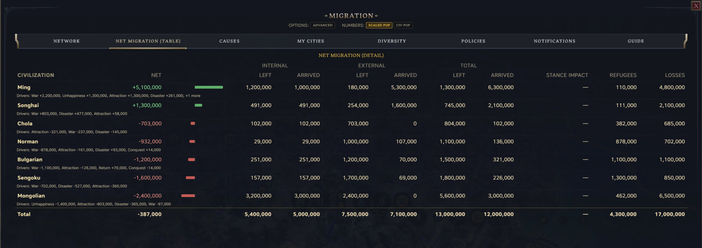</a><br><sub>Net Migration: internal and external movement for every civilization</sub></td><td width="50%" align="center" valign="top"><a href="docs/steam-screenshots/03-dashboard-causes.jpg">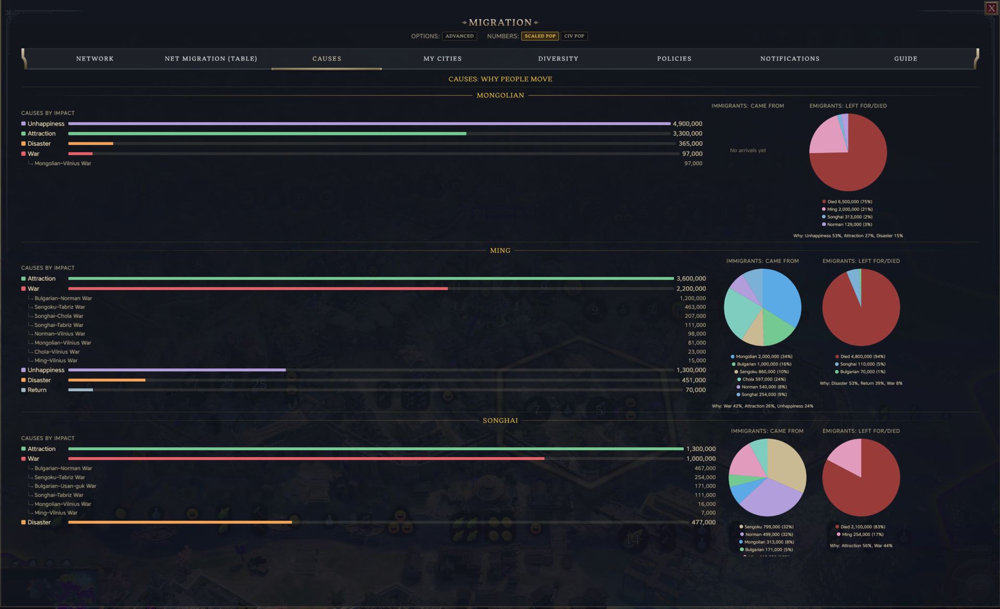</a><br><sub>Why people move: causes broken down by named war, disaster, and crisis</sub></td></tr>
  <tr><td width="50%" align="center" valign="top"><a href="docs/steam-screenshots/04-dashboard-diversity.jpg">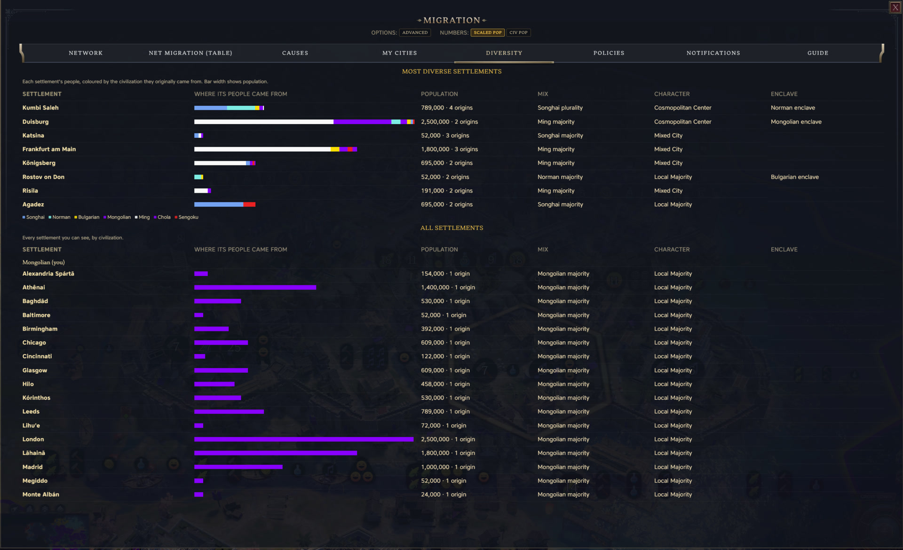</a><br><sub>Diversity: the most mixed settlements and every settlement's origins</sub></td><td width="50%" align="center" valign="top"><a href="docs/steam-screenshots/05-refugee-decision.jpg">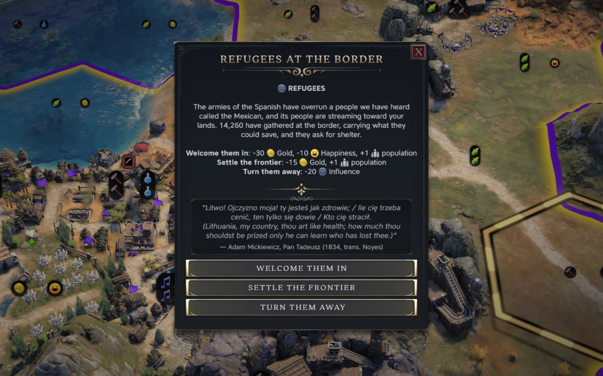</a><br><sub>A refugee decision after an upheaval, in the words of that people's own refugees</sub></td></tr>
  <tr><td width="50%" align="center" valign="top"><a href="docs/steam-screenshots/06-newcomer-placement.jpg">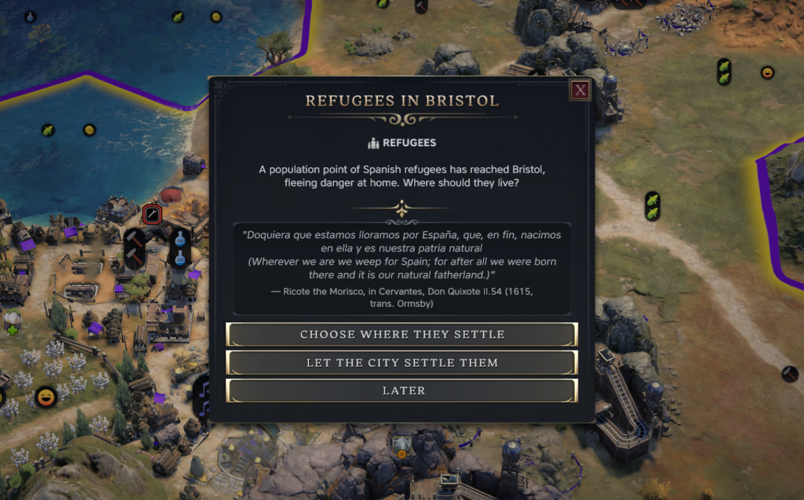</a><br><sub>Newcomers: choose where arrivals settle</sub></td><td width="50%" align="center" valign="top"><a href="docs/steam-screenshots/07-call-home-offer.jpg">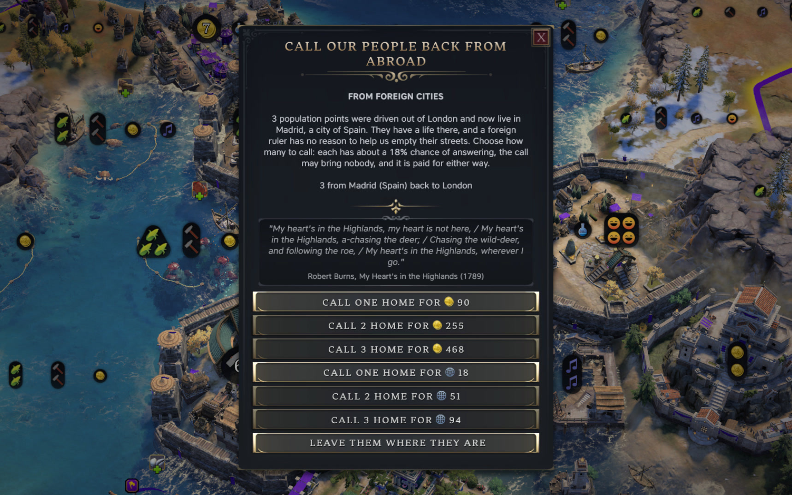</a><br><sub>Calling your people home: three sizes, priced in Gold or Influence</sub></td></tr>
  <tr><td width="50%" align="center" valign="top"><a href="docs/steam-screenshots/08-enclave-stance.jpg"></a><br><sub>A Cultural Enclave asks for your stance</sub></td><td width="50%" align="center" valign="top"><a href="docs/steam-screenshots/09-enclave-on-map.jpg">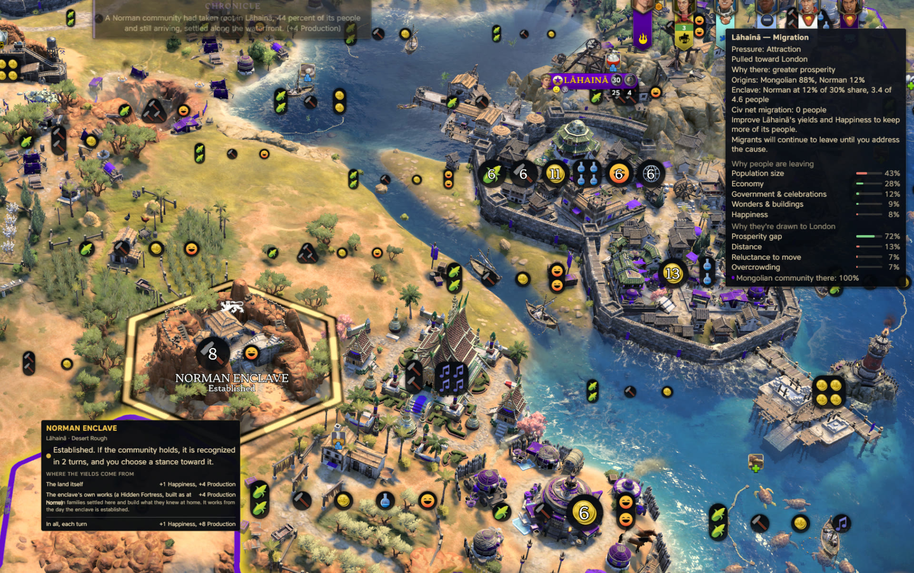</a><br><sub>An enclave on the map, with its own tooltip and the city's migration readout</sub></td></tr>
  <tr><td width="50%" align="center" valign="top"><a href="docs/steam-screenshots/10-ethnic-composition-lens.jpg">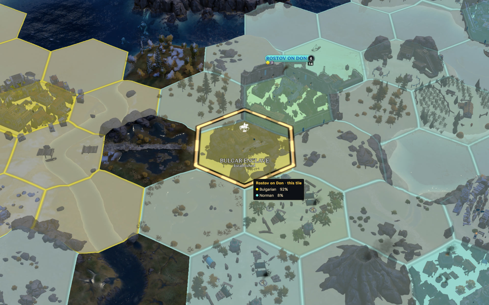</a><br><sub>The Ethnic Composition lens: Rostov on Don and its Bulgar Enclave</sub></td><td width="50%" align="center" valign="top"><a href="docs/steam-screenshots/11-prosperity-lens.jpg">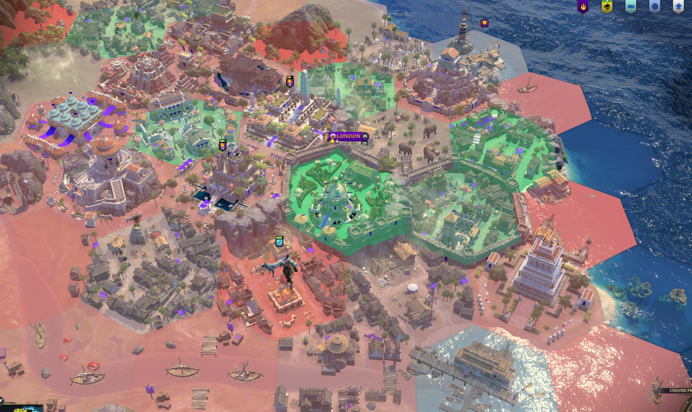</a><br><sub>The Prosperity lens: every tile scored in points</sub></td></tr>
  <tr><td width="50%" align="center" valign="top"><a href="docs/steam-screenshots/12-civilopedia-voices-rome.jpg">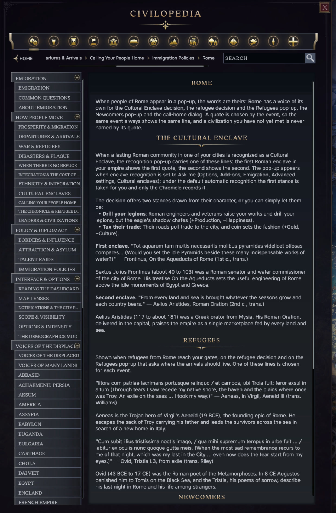</a><br><sub>Civilopedia: Voices of the Displaced, one page for every people</sub></td><td width="50%" align="center" valign="top"><a href="docs/steam-screenshots/13-civilopedia-departures-arrivals.jpg">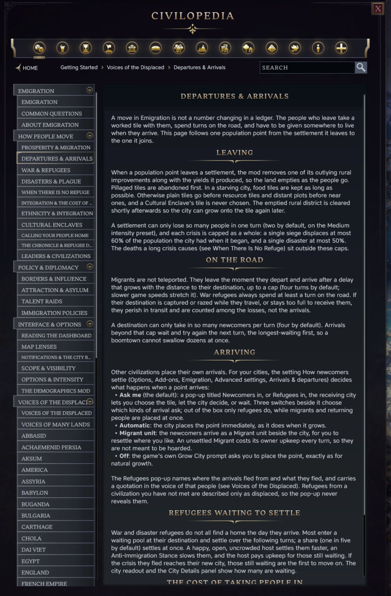</a><br><sub>Civilopedia: how departures and arrivals work</sub></td></tr>
</table>

## FAQ

### Why do people move?

- Settlements are scored each turn on yields, happiness, war weariness, and government. Lower-scoring settlements lose people to stronger ones.
- War damage, sieges, and pillaged tiles create refugees.
- Starvation, unrest, plague, disasters, and overcrowding also push people out.
- Causes run independently, so a city can lose war refugees and economic migrants in the same turn.
- What a settlement has built (wonders, and each kind of civic building) is a reason to stay, and it is not divided by population, so building well lets a large city hold its people.
- The pressure behind ordinary departures fades when a settlement's troubles pass, so only a strong, lasting reason to leave empties a city over time.

### Where do they go?

- Nearby settlements are preferred.
- War refugees prefer their own civilization, then neutral civilizations, and avoid the attacker.
- Cross-civilization movement is shaped by borders, alliances, war, asylum, immigration stances, and Open Borders.

### What does a move change?

- A departure removes an outlying rural improvement and its yields. Pillaged tiles go first; starving cities keep food tiles as long as possible.
- Migrants spend several turns in transit, depending on distance and game speed.
- Arrival behavior is configurable. Refugees can ask where to settle; migrants and returnees settle automatically by default.
- War and disaster refugees can spend additional time resettling after arrival. The host pays upkeep while they wait.
- Arrivals add a temporary gold cost and delay the next Celebration. Congestion limits intake.
- Sustained siege, famine, war, or disaster can kill people who cannot escape.
- One siege displaces at most 60% of onset population; one disaster at most 50%.

### How are identity and history tracked?

- Settlements track population by civilization of origin, including after capture. Migrants carry the mix of the city they left, so a diaspora that moves on keeps its identity.
- A conquered city the mod first sees after the conquest (added mid-game, or a save from before the ledger) counts as its original civilization's people.
- The Ethnic Composition lens (Shift+E) maps that composition by tile and repaints at the start of each turn, even while it is open.
- Newcomers integrate over time; war with the homeland stops integration and unrest slows it.
- Diasporas can return home when the homeland is peaceful and prosperous.
- Lasting foreign communities can form Cultural Enclaves. Enclaves persist while the community does and can be built over.
- Refugee decisions, displaced-person quotes, and the Migration Chronicle add narrative context.

### How do I see what is happening?

- Toasts and the Notifications log record each move and its cause.
- The dashboard shows flows by civilization, cause, and settlement.
- City readouts show local pressure, reasons to leave and to stay, and enclave progress, and the dashboard shows them across every settlement.
- Hovering an enclave's tile shows its stage and the source of every yield it brings in.
- The Civilopedia's Emigration section describes every system, policy card, and option, and lists every quotation with a note on its speaker.
- The Prosperity lens maps prosperity by tile: wonders, the centre, buildings and quarters, worked land, rivers and natural wonders score up; ruin scores down. Hover a tile to see the terms.
- With Demographics installed, migration also appears in graphs and tables.

### What can I tune?

- Low, Medium, and High intensity presets plus individual options under Options ▸ Mods ▸ Emigration.
- Per-leader and per-civilization tuning.
- Automatic game-speed scaling from Online to Marathon.
- Interface text in 12 languages.

## Install & run

1. Copy this folder to `~/Library/Application Support/Civilization VII/Mods/emigration/`, relaunch, and enable **Emigration** in *Additional Content*.
2. Play turns. With `const DBG = true` (the dev default), the mod logs to `UI.log`:
   ```
   grep -E "EMIG_" "~/Library/Application Support/Civilization VII/Logs/UI.log"
   ```
   `release.sh` sets `DBG` to `false` for shipped builds.
3. **Dev dock buttons:** run a pass or dump the prosperity ranking. Console: `emigration.runNow()`, `emigration.rank()`, `emigration.window()`, `emigration.city(id)`.
4. **Tune or disable layers:** Options → Add-ons → Emigration → **Advanced settings**. All advanced-model and interactive-system switches default on.

Useful log markers: `EMIGRATION … left … for …`, `assimilation: …`, and `ATTRITION … (no refuge)`.

## Migration dashboard

Available through an optional dock button or the Demographics interface. Tabs cover Migration Network, Net Migration, Why People Move, Settlements, Diversity, Immigration Policies, Notifications, and Guide.

The dashboard reflects saved gameplay state, not cosmetic estimates: population, abandoned and settled tiles, gold, and Influence all change in game (§12).

### Documentation
- Player experience risks and mitigations: [docs/player-experience-risks.md](docs/player-experience-risks.md)
- Player experience items addressed: [docs/player-experience-addressed.md](docs/player-experience-addressed.md)
- UI-script engine limits: [docs/engine-limits-from-probes.md](docs/engine-limits-from-probes.md)
- Tooltip compatibility with other tooltip mods: [docs/tooltip-mod-compatibility.md](docs/tooltip-mod-compatibility.md)
- Migration mechanics: [DESIGN.md](../../mods_research_and_analysis/emigration-docs/DESIGN.md)
- Engine checks and verification: [FINDINGS.md](../../mods_research_and_analysis/emigration-docs/FINDINGS.md)
- In-game validation: [testing-requirements.md](../../mods_research_and_analysis/emigration-docs/testing-requirements.md)
- Civ VII modding mechanics and limits: [civ7-mechanics-and-feasibility.md](../../mods_research_and_analysis/emigration-docs/civ7-mechanics-and-feasibility.md)
- Leader/civ ability and memento interactions: [leader-civ-memento-interactions.md](../../mods_research_and_analysis/emigration-docs/leader-civ-memento-interactions.md)
- Advanced migration formulas: [algorithmic-improvements.md](../../mods_research_and_analysis/emigration-docs/algorithmic-improvements.md)
- Interactive systems: [interactive-extensions-design.md](../../mods_research_and_analysis/emigration-docs/interactive-extensions-design.md), [interactive-extensions-implementation.md](../../mods_research_and_analysis/emigration-docs/interactive-extensions-implementation.md)

---

## System Guide and Feature Reference

*The overview ends here. The rest is the technical reference: systems, formulas, modules, tuning, persistence, and engine limits.*

## Contents

1. [What it does (player-facing)](#1-what-it-does-player-facing)
2. [How it works: the per-turn loop](#2-how-it-works-the-per-turn-loop)
3. [The signals & the Prosperity score](#3-the-signals--the-prosperity-score)
4. [Population scaling (Demographics alignment)](#4-population-scaling-demographics-alignment)
5. [The advanced model (algorithms & per-civ tuning)](#5-the-advanced-model-algorithms--per-civ-tuning)
6. [Interactive systems (on by default)](#6-interactive-systems-on-by-default)
7. [Consequences: the gameplay-write cost layer](#7-consequences-the-gameplay-write-cost-layer)
8. [Reporting & Demographics integration](#8-reporting--demographics-integration)
9. [In-game feedback & notifications](#9-in-game-feedback--notifications)
10. [Options & tuning](#10-options--tuning)

*Appendices*

11. [Architecture / module map](#11-architecture--module-map)
12. [Runtime behavior in game](#12-runtime-behavior-in-game)
13. [Persistence](#13-persistence)
14. [Localization](#14-localization)
15. [Development](#15-development)
16. [Compatibility & mod coexistence](#16-compatibility--mod-coexistence)
17. [Known open issues](#17-known-open-issues)
18. [Engine limits](#18-engine-limits)

---

---

## 1. What it does (player-facing)

Each turn, the mod scores settlements and moves population from weaker ones toward stronger nearby destinations.

- **Peacetime:** unhappy or low-yield settlements lose people to happier, wealthier ones.
- **War refugees:** district damage, siege, and pillaging cause rapid flight away from the nearest invader.
- **Concurrent causes:** war, disaster, and economic pressure are evaluated independently, so several can act on the same city in one turn.
- **Cross-civilization:** migration can stay within a civilization or cross borders.
- **Regional:** distance reduces pull, so nearby destinations usually win.
- **Consequential:** arrivals add integration costs and congestion, preventing unlimited growth.
- **Speed-aware:** pacing scales with game speed (§2).

Moves appear in toasts, Demographics graphs, and the dev log, for example:
`EMIGRATION 1 population point (≈30,000 people) left Rome (Romans) for Carthage (Carthaginians)`.

### Quick reference: what counts

Defaults are shown below; most are tunable in §10 and on the dashboard's **Guide** tab.

**What makes people leave**

| | Counts? | |
|---|:---:|---|
| Unhappiness / low yields | ✓ | Main peacetime driver; happiness weighs most, with low per-capita yields adding pressure |
| Empire-wide war weariness | ✓ | Modest civ-wide pressure on top of local violence |
| War damage to districts | ✓ | More damage means more pressure |
| Being besieged or attacked | ✓ | Applies only to the affected city |
| Attacked by a city-state / Independent Power | ✓ | Same local conflict pressure as a major-civ war |
| Pillaged tiles in the city's borders | ✓ | Damaged improvements on the city's own plots |
| Starvation | ✓ | Most flee; some die until food recovers |
| Plague / disease | ✓ | Infected cities lose people; plague carry is optional |
| Natural disasters | ✓ | Capped per-city pressure around the event |
| Overcrowding | ✓ | Tall cities push population outward |

**What attracts**

| | Attracts? | |
|---|:---:|---|
| Higher prosperity | ✓ | Weighted per-capita food, production, gold, science, and culture |
| Higher happiness | ✓ | Strongest factor, but capped by the shaped model |
| Pro-Immigration Stance | ✓ | Raises inbound pull and Influence |
| Open Borders | ✓ | Cross-civ pull bonus |
| Being nearby | ✓ | Distance-penalized |
| What a settlement has built | ✓ | Wonders and each kind of civic building count as a reason to stay, not divided by population |

**Who participates**

| | Participates? | |
|---|:---:|---|
| Your civilization | ✓ | Sends and receives like any major civ |
| Towns | ✓ | Same system as cities |
| Your own settlements | ✓ | Internal migration shown separately |
| Other major civilizations | ✓ | Simulated from turn one |
| Unmet civilizations | ✓ | Simulated but masked in the UI by default |
| City-states / minor civs / Independent Powers | ✗ | Do not send or receive, though attacks by them can cause flight |

**Behavior**

| | | |
|---|:---:|---|
| Migration between civilizations | ✓ | Shaped by borders, distance, and stance |
| Distant AI-vs-AI wars | ✓ | Only when they damage, besiege, or pillage a city's own territory |
| Anti-Immigration Stance retains people | ✓ | More retention and Production, less Influence |
| No Open Borders reduces cross-civ flow | ✓ | Movement remains possible but is harder |
| Population and yields change | ✓ | Real gameplay writes |
| Pacing adapts to game speed | ✓ | Cooldowns, ramps, transit, and thresholds scale (§2) |
| Systems can be tuned or disabled | ✓ | Presets + 121 options |
| Fighting outside a city's borders | ✗ | Does not drive that city's emigration |
| Migrants arrive instantly | ✗ | Travel takes time |
| Absorbing migrants is free | ✗ | Temporary happiness/celebration and gold costs apply |
| War can empty a city to zero | ✗ | Displacement is capped; crisis deaths are separate |

**Identity, integration & return**

| | | |
|---|:---:|---|
| Settlements remember origins | ✓ | Composition by origin civ, preserved through capture |
| Migrants keep their identity | ✓ | A migrant carries the mix of the city they left |
| Newcomers integrate | ✓ | Non-owner origins drift toward the owner over time |
| War / unrest slows integration | ✓ | War with the homeland stops it; unrest slows it |
| Diasporas return home | ✓ | Possible when the homeland is peaceful and prosperous |
| Refugee waves can prompt a decision | ✓ | Welcome / frontier / turn away |
| Migrations become history | ✓ | Migration Chronicle entries in Notifications |

**Scope & limits**

| | | |
|---|:---:|---|
| Changes AI or replaces base-game files | ✗ | Additive only |
| Moves population instantly | ✗ | Distance and transit apply |
| Lets you place individual migrants | ✗ | You shape flows indirectly; local arrivals can be placed |
| Lets one civ snowball unchecked | ✗ | Field-relative scoring, congestion, and anti-snowball headwinds limit runaway inflow |

**Post-war recovery**

- **Will a war-shrunk city recover?** Usually. Displacement removes rural improvements, but the city and districts remain unless captured. Food growth and immigration can rebuild population after the fighting stops.
- **Do refugees return?** Some can through Return Migration (§6g) once the homeland is peaceful and prosperous.
- **Does repairing pillaged tiles restore population?** No. It removes pressure but does not add population.
- **How far can war shrink a city?** Displacement is capped at `siegeLossCapPct` (60% by default) of onset population. Crisis deaths are separate and can reduce rural population further.
- **Fastest recovery:** make peace, repair pillaged tiles, and raise happiness.

**Migration in transit**

Moves are delayed by `transitLagTurns`, scaled by distance and game speed.

- **Rate:** war and disaster refugees can flee every turn; voluntary migration is slower. Each civilization has its own budget.
- **Lifecycle:** departure removes the source rural point immediately. In transit, the migrant belongs to no city. Integration cost begins on arrival.
- **Per-city caps:** `maxLossPerCityPerTurn` and `maxGainPerCityPerTurn`, scaled by intensity. Deaths do not count against them.
- **Failed arrivals:** migrants wait if the destination is full. They can die in transit if the destination is razed, captured, or remains full.
- **Travel time:** typically 1–4 turns on Standard (`transitHexPerTurn` ≈ 5 hexes/turn); war/disaster refugees take at least one turn.
- **Reporting:** Emigration can rise before Immigration catches up. Net Migration counts only settled cross-civ moves.

---

## 2. How it works: the per-turn loop

On each `PlayerTurnActivated`:

1. **Per-civ costs** (`chargePerTurnCosts`) run for the active civilization: decaying integration cost and migrant-unit holding cost (§7).
2. **The emigration pass** (`runPass`) runs once on the local player's turn, gated by `turnInterval`:
   1. Decay violence and disaster distress.
   2. Build one `CitySignal` per simulated city (§3).
   3. Score and rank settlements by Prosperity (§3, §5).
   4. Advance state: scaling turn, cooldowns, and per-owner population totals used for congestion.
   5. Process each source on the voluntary and crisis tracks below. Each civilization has its own safety ceilings: `maxMovesPerTurn + movesPerCity × settlements` for voluntary movement and `movesPerSiege × cities in crisis` for crisis movement.
   6. Persist state to `GameConfiguration` and publish feedback (§9).
3. **Events** registered at boot update supporting state: `DiplomacyDeclareWar` / `MakePeace` maintain the aggressor map (§6a), while `RandomEventOccurred` records disaster distress (§6c).

### Two concurrent tracks: voluntary vs crisis (`splitTracksEnabled`)

Each source runs two independent tracks, so both can fire in the same turn:

- **Crisis** (war / disaster): can flee every turn, with no pressure bar or cooldown, bounded by `warSurgeMax` and `siegeLossCapPct`. Cause is *disaster* when disaster distress dominates; otherwise *war*.
- **Voluntary** (prosperity / unhappiness): builds pressure toward `emigrationBar`, moves one point when the bar is crossed, then waits `cooldownTurns`. Cause is *unhappiness* when happiness is low; otherwise *prosperity*. Pressure carries over each turn at `pressureRetention` (0.9, re-based for game speed; "Pressure kept each turn", Advanced ▸ Pacing), so it tracks the settlement's current situation in both directions, with a half-life of about 7 turns. A departure clears it outright, and settlements on a cooldown or with nowhere to go cool down too. At the default only a steady pull above about a third of the bar per turn reaches the bar; `pressureRetention = 1` keeps pressure indefinitely.

Each track has its own per-civ budget (`splitBudgetsEnabled`). Records still carry one cause each, so cause-level telemetry stays clean. The city readout can show the live mix, such as `"War 60% · Prosperity 40%"` (`splitUiReadoutEnabled`). All three flags default on.

If a severely distressed city has no viable destination, it builds attrition pressure and can lose a rural point as a death rather than a move (§6d).

### Game speed (all turn-based pacing scales, `gameSpeedTuningEnabled`)

Game speed changes how many turns cover the same game progress. The mod scales turn-based pacing with **S** so migration behaves similarly in game-time across speeds.

| Speed | CostMultiplier | S | cooldown 8 → | bar 30 → |
|---|---:|---:|---:|---:|
| Online | 50 | 0.5 | 4 | 15 |
| Quick | 67 | 0.67 | 5 | 20 |
| **Standard** | **100** | **1.0** | **8** | **30** |
| Epic | 150 | 1.5 | 12 | 45 |
| Marathon | 300 | 3.0 | 24 | 90 |

- **Durations ×S:** `cooldownTurns`, `siegeRampTurns`, `transitLagTurns`
- **Thresholds ×S:** `emigrationBar`, `attritionThreshold`
- **Decay re-based to `d^(1/S)`:** `violenceDecay`, `disasterDecay`
- **Not scaled:** `siegeLossCapPct`, intensity thresholds, yield weights, friction, or per-turn move ceilings

The active speed is read from `Configuration.getGame().gameSpeedType` and `GameInfo.GameSpeeds.lookup(...).CostMultiplier`, cached, and falls back to `S = 1` if unavailable. `gameSpeedTuningEnabled` is the rollback switch. See [`emigration-game-speed.js`](ui/emigration-game-speed.js). The separate `gameSpeedScalePopulation` flag is off by default and affects only the §4 representative-people scaling.

---

## 3. The signals & the Prosperity score

`emigration-cities.js` builds a `CitySignal` for each city: owner, population, rural and urban population, per-capita yields, happiness, unrest, starvation, siege state, war state, violence, disaster distress, and infection. `emigration-prosperity.js` converts that signal into a score. The legacy linear model is:

$$
\begin{aligned}
P &= \left(Q + h\,\lambda_h - n\,\lambda_n\right)\left(1 + \frac{s}{100}\right) + B, \\
Q &= \frac{f\,w_F + p\,w_P + g\,w_G + sc\,w_S + c\,w_C}{n^{\epsilon}}, \\
s &= v + d + \sigma + \tau + u.
\end{aligned}
$$

$P$ is prosperity, $Q$ per-capita productiveness, $h$ net happiness, $n$ population, and $s$ the combined situational percentage from violence, disaster, siege, starvation, and unrest. $\epsilon$ is `popExponent` (0.85, "Size dilutes prosperity"): below 1 it softens the per-head average, so a settlement's size divides away less of what it produces; 1 is a straight average.

$B$ is the built environment (`emigration-built.js`, `builtEnabled`, "Buildings are a reason to stay"): each wonder (1.5, up to `builtWonderCap` = 3) plus each *kind* of civic building present, counted once however many there are: amenity 1.0; safety, sustenance, learning and trade 0.8; shelter, culture and work 0.6; any other building 0.3. The total is capped at `builtCap` (6). It is neither divided by population nor scaled by happiness. Kinds are read from the compiled database by what a building grants, so buildings added by an age, DLC or another mod count; pillaged buildings do not. The scan refreshes every `builtRefreshTurns` (5). The city panel lists these as **Reasons to stay**, and the explainer adds a **Wonders & buildings** row.

Higher scores are more attractive. Happiness carries the largest default weight (`localHappinessFactor = 6`). Negative situational pressure drives both emigration and `distress(s)`, which feeds crisis death (§6d) and the city readout. §5 replaces the linear happiness and violence behavior with the shaped model when enabled.

### Polity signals (`emigration-polity.js`): happiness stages, governments, celebrations (1.4.1)

With `polityModelEnabled`, the model also reads:

- **Happiness stage:** the five-stage Angry (−2) to Ecstatic (+2) ordinal, adding bounded pull/push through `happinessStageWeight`.
- **Celebration:** Golden Age civilizations get extra attraction through `celebrationPull`.
- **Government:** a small clamped tie-breaker through `governmentWeight` and `governmentLeanCap`; most government effects already arrive through yields and happiness.
- **War weariness:** a modest civilization-wide push through `warWearinessModifier`, separate from local violence.

These values are read once per civilization per pass and copied onto each `CitySignal`.

### Violence (`emigration-violence.js`): polled, fog-independent

War migration responds to violence inside a city's own territory, not merely to being at war. Signals are read from game state, so the same rules apply to visible and distant AI wars.

- **District damage:** center-district health provides fresh-assault (`vwAssault`) and standing-siege (`vwSiege`) pressure.
- **Pillage:** damaged improvements on `getPurchasedPlots()` add `vwPillage`.
- **Persistence:** violence accumulates and decays through `violenceDecay`, adjusted to `d^(1/S)`. Sustained siege grows; isolated raids fade in about 2–3 turns of game-time. Algorithm D adds siege escalation and a cumulative cap (§5-D).

All checks are territory-scoped. Fighting elsewhere, neutral-field battles, and damage outside the city's footprint do not move its population. `sig.atWar` is informational only. A district marked besieged can still count when the besieging unit stands just outside the border; `siegeBesiegedFloor` keeps that pressure gradual.

### Geography (`emigration-geography.js`)

- **Distance:** `−distanceFactor × hexDistance`
- **Flee vector:** above `violenceFleeThreshold`, refugees prefer destinations away from the nearest enemy (`fleeFactor`)
- **Aggressor preference:** own civ > neutral > attacker when §6a is enabled
- **Open Borders:** `openBordersBonus` raises cross-civ pull between civilizations with an active agreement

### The destination decision (`emigration-pull.js`)

Destination pull combines prosperity, targeted attraction, friction, and relationship permeability:

$$
\begin{aligned}
\mathrm{Pull}(s,d) &= \Big(\Delta\mathrm{Pros}(s,d) + \mathrm{Tilt}(s,d) - \mathrm{Friction}(s,d)\Big) \cdot \Pi(s,d), \\
\Delta\mathrm{Pros}(s,d) &= \mathrm{Pros}(d)-\mathrm{Pros}(s), \\
\mathrm{Tilt}(s,d) &= \mathrm{clamp}\big(\mathrm{asylumTilt}(s,d),-\mathrm{tiltCap},\mathrm{tiltCap}\big), \\
\Pi(s,d) &= \mathrm{clamp}\big(\mathrm{openness}(d)\cdot\mathrm{retention}(s)\cdot\mathrm{permOpenBorders}^{ob}\cdot\mathrm{permAlly}^{al}\cdot\mathrm{permWar}^{wa},\ \mathrm{permeFloor},\mathrm{permeCeil}\big).
\end{aligned}
$$

`openness(d)` controls inbound cross-civ flow and `retention(s)` controls outbound cross-civ flow. Both are neutral unless border policies are active (§6b).

Friction is:

$$
\begin{aligned}
\mathrm{Friction}(s,d) ={}& \mathrm{baseReluctance} + \mathrm{perExtraPop}\cdot\max\big(0,\mathrm{pop}(d)-\mathrm{pop}(s)\big) \\
&{}+ \mathrm{perFewerPop}\cdot\max\big(0,\mathrm{pop}(s)-\mathrm{pop}(d)\big) \\
&{}+ \mathrm{cityStateBarrier} + \mathrm{poachBlock} - \mathrm{geoAdjust}(s,d) \\
&{}+ \mathrm{congestionFor}(d) + \mathrm{dominanceFor}(d) + \mathrm{drainFor}(s) - \mathrm{internalRefuge}(s,d).
\end{aligned}
$$

`perFewerPop` (0.5, "Reluctance to move somewhere smaller", Advanced ▸ Brakes) mirrors `perExtraPop`: the score's per-citizen term favours a smaller destination simply for being smaller, so moving down in size costs the same per citizen as crowding into a bigger place.

`internalRefuge(s,d)` gives crisis refugees a bonus toward destinations inside their own civilization; `crisisEscapeBonus` provides the corresponding escape incentive when no good homeland option exists. Both move with the "Movement between civilizations" slider. `drainFor(s)` reduces cross-civ outflow from civilizations below their fair population share.

`dominanceFor(d)` is the anti-snowball term:

$\mathrm{antiSnowballWeight}\cdot\max\!\left(0,\frac{\mathrm{pop}_\text{civ}(d)}{\overline{\mathrm{pop}}_\text{civ}}-\mathrm{antiSnowballThreshold}\right)^{\mathrm{antiSnowballExponent}}$.

It applies only to cross-civ inflow into an above-average civilization and is tunable by strength and threshold.

War is not a hard routing gate. A besieged city simply becomes less prosperous, gains a flee vector, and then uses the same pull equation.

### The Prosperity map lens (`emigration-prosperity-lens.js`, `emigration-prosperity-tooltip.js`)

The lens scores each tile in points, as the sum of named terms: a wonder on the tile (+6), the city centre (+3), each building (+2, and +1 for a completed quarter), a worked improvement (+1), the tile's own yield (+1 per 3), a river (+1), a natural wonder on the tile (+3) or next to it (+2 each), a wonder next to it (+1 each), and anything pillaged on the tile (−3 each) or next to it (−1 each). The score is absolute and banded, so a wonder tile reads the same in every settlement: **Flourishing** (8+), **Thriving** (5–7), **Ordinary** (2–4), **Meagre** (0–1), **Blighted** (below 0). Wonders and natural wonders are recognised from the game's database, so ones added by an age or another mod count. Empty sea is excluded; worked coast counts normally.

Hovering a tile shows its band, its score, and every term behind it, then the settlement's world standing. Both the lens and the readout read the same scores from `emigration-tile-score.js`.

---

## 4. Population scaling (Demographics alignment)

`emigration-population.js` converts abstract population points into representative people using the same formula as the Demographics mod, based on Civ VII's per-era growth cost:

```text
W(N, era)           = Σ cost(1..N) for era's {flat, scalar, exp}
eraParams(age, pct) = blend(prev-era, this-era params)
scaleCityPopulation = POP_K × W(size, eraParams) × megacity × overtime, soft-capped to the era max
```

Each age uses the game's own growth parameters, blended across age boundaries. A Modern megacity term lets the largest cities reach roughly 10–38M people; an endgame term extends growth past the normal endpoint; and a soft era ceiling limits the result.

Scaling is age-based, not turn-based, so game speed does not change the reported population. A moved point is reported as `scale(pop) − scale(pop−1)`, with small event-level variation based on source happiness and urban/rural mix. `moveRural` relocates a point; `removeRural` removes one with no destination using the same rural-population accounting as starvation.

> **Aligned with Demographics.** Both mods carry the same scaling and are checked bit-for-bit by `tests/scaling-demographics-parity.mjs`. Turn-based migration pacing still scales by game speed (§2).

---

## 5. The advanced model (algorithms & per-civ tuning)

Four algorithms and a per-civ tuning table refine the baseline. All default on and can be disabled in Options. Full math and comparisons: [algorithmic-improvements.md](../../mods_research_and_analysis/emigration-docs/algorithmic-improvements.md).

### A. Shaped happiness (`happinessShaped`)

The original linear `happiness × 6` term let extreme happiness bonuses dominate the model. The shaped version compares happiness with the world mean, saturates positive pull, steepens severe unhappiness with `tanh`, and uses happiness to amplify the economy rather than replace it. Franklin's Glass Armonica drops from roughly a 50× attraction effect to about 2× while deeply unhappy cities still shed strongly.

### B. Overcrowding discount (`overcrowdDiscount`)

Civ VII charges no happiness per population point; tall-city unhappiness comes from density past the overcrowding threshold. Because `getYield` already includes the unhappiness penalty, tall cities would otherwise be penalized twice. This discount credits back density-driven unhappiness using `urbanPopulation` and `overcrowdThreshold`.

### C. Congestion headwind + leader variance (`congestWeight`)

A civilization that has recently absorbed many migrants becomes a less attractive destination, based on per-capita assimilation load. `integrationSpeed` controls load decay and `assimilationEase` controls the gold cost. This provides a structural brake that cannot be overcome simply by producing more gold.

### D. Capped, time-gated war displacement (`warSiege`)

War pressure escalates from `siegeFloor` to full strength over `siegeRampTurns` (×S) and total displacement is capped at `siegeLossCapPct` of onset population. A city can lose substantial population but cannot be emptied by displacement alone.

### The civ tuning table (`emigration-civ-tuning.js`, `civTuningEnabled`)

A bounded registry adjusts leaders and civilizations whose abilities materially affect migration. Leader entries override civ entries. An alternate persona is treated as its own leader, because the engine
reports the `_ALT` type and the two personas can pull in opposite directions. Fields are `happinessPull`, `integrationSpeed`, `assimilationEase`, `overcrowdDiscount`, `warRetention`, and `sourceBias`.

Examples: Franklin `happinessPull 0.75`, Isabella `0.85` + `ease 1.2`, Xerxes `ease 1.25`, Khmer `sourceBias 1.5`, Pachacuti `overcrowdDiscount 0.5`, and Norman `warRetention 1.4`. Structural anti-runaway behavior still comes from the algorithms, not these nudges.

**Brush & Blade coverage.** Expansion civs and leaders are mapped to the same six fields. Conquest economies pay more to absorb spoils; defensive civs retain more population under siege; happiness magnets are damped; tall/few-settlement civs get relief from density penalties; and high-growth or food-penalized profiles get small source cushions. Civs and leaders without a migration-relevant outlier stay neutral.

**Flatten knob (`civTuningStrength`, default 0.7).** `1.0` uses the full table and `0` flattens every profile to neutral. The default preserves relative differences while shrinking them by about 30%.

---

## 6. Interactive systems (on by default)

### 6a. Aggressor-aware war refugees (`aggressorPenalty`, 0 = off)

When civ A attacks civ B, B's refugees prefer B's own settlements, then neutral civilizations, and treat A as a last resort. `DiplomacyDeclareWar` provides the declarer and target; `emigration-war.js` persists a victim→aggressors map until peace. `ownCivRefugeeBonus` and `−aggressorPenalty` feed `geoAdjust` only for cities under violence.

### 6b. Immigration-stance policies + Open Borders agreements

Two separate mechanics shape cross-civ migration.

**Immigration stance (`bordersEnabled`).** Each age adds **Pro-Immigration Stance** and **Anti-Immigration Stance** policy cards. They unlock at **Citizenship** (Antiquity), **Economics** (Exploration), and **Social Question** (Modern). Internal IDs retain `TRADITION_EMIG_OPEN/CLOSED_BORDERS_*`.

- **Pro-Immigration Stance:** inbound migration ×1.5 plus +1/+2/+3 Influence.
- **Anti-Immigration Stance:** inbound migration ×0.4 (floor 0.15), own cross-civ outbound pull ×0.6, +2/+3/+4 Production per city, and −2/−3/−4 Influence.

Migration and retention are custom UI-VM mechanics. Influence and Production are native `TraditionModifier`s from `data/emigration-policies-gameeffects.xml`.

**Diplomatic Open Borders (`openBordersBonus`).** An active base-game Open Borders agreement increases migration both ways. Checked in `emigration-geography.js`; console: `emigration.openBorders(aPid, bPid)`.

Governments no longer directly modify emigration.

#### Policy cards by age (shipped)

Antiquity:

| Policy (Civic) | Effects |
|---|---|
| Pro-Immigration Stance (Citizenship) | +1 Influence/turn; migration pull ×1.5 |
| Anti-Immigration Stance (Citizenship) | −2 Influence/turn, +2 Production/city; inbound ×0.4, outbound ×0.6 |

Exploration:

| Policy (Civic) | Effects |
|---|---|
| Pro-Immigration Stance (Economics) | +2 Influence/turn; migration pull ×1.5 |
| Anti-Immigration Stance (Economics) | −3 Influence/turn, +3 Production/city; inbound ×0.4, outbound ×0.6 |
| Talent Attraction (Inspiration) | +1 Science/turn; +1.5 Science pool per arrival |
| Cultural Magnetism (Society) | +1 Culture/turn; +1.5 Culture pool per arrival |
| Commercial Draw (Mercantilism) | +1 Gold/turn; +1.5 Gold pool per arrival |
| Selective Asylum (Piety) | +1 Influence/turn; refugee pull tilt |

Modern:

| Policy (Civic) | Effects |
|---|---|
| Pro-Immigration Stance (Social Question) | +3 Influence/turn; migration pull ×1.5 |
| Anti-Immigration Stance (Social Question) | −4 Influence/turn, +4 Production/city; inbound ×0.4, outbound ×0.6 |
| Talent Attraction (Modernization) | +2 Science/turn; +1.5 Science pool per arrival |
| Cultural Magnetism (Natural History) | +2 Culture/turn; +1.5 Culture pool per arrival |
| Commercial Draw (Capitalism) | +2 Gold/turn; +1.5 Gold pool per arrival |
| Refugee Compact (Political Theory) | +2 Influence/turn, +1 Culture/turn; refugee pull tilt |

Internal IDs: `OPEN_BORDERS` = Pro-Immigration, `CLOSED_BORDERS` = Anti-Immigration, `TALENT` = Talent Attraction, `CULTPULL` = Cultural Magnetism, `TRADEPULL` = Commercial Draw, and `ASYLUM` = Selective Asylum / Refugee Compact. Prefix `TRADITION_EMIG_`; age suffixes are `_ANTIQUITY`, `_EXPLORATION`, and `_MODERN`.

#### How attraction policy card yields function

Attraction cards stack two yield layers:

1. A fixed native yield from `data/emigration-policies-gameeffects.xml`.
2. A carried dividend from immigrant intake (`emigration-dividend.js`):

$$
\mathrm{pool}_{y} \leftarrow \mathrm{pool}_{y} + \mathrm{dividendPerMigrant}
$$

Each turn:

$$
\begin{aligned}
\mathrm{pool}_{y} &\leftarrow \mathrm{pool}_{y}\cdot\mathrm{dividendDecay}^{\Delta t}, \\
\mathrm{grant}_{y} &= \min(\mathrm{dividendCap},\ \mathrm{pool}_{y})
\end{aligned}
$$

Defaults are `dividendPerMigrant = 1.5`, `dividendDecay = 0.7`, and `dividendCap = 12` per turn per channel. The flat Influence bonus is part of the card; only the carried dividend scales with arrivals.

### 6c. Environmental disasters & plague (`disastersEnabled`)

Floods, volcanoes, plague, hurricanes, blizzards, tornadoes, dust storms, and thunderstorms add per-city disaster distress in `emigration-disasters.js`. Distress decays with game-speed adjustment and lowers prosperity, producing disaster refugees. Signals come from `city.isInfected` and `RandomEventOccurred`, so they do not depend on visibility.

Optional `plagueCarryEnabled` lets migrants from an infected city seed smaller outbreak distress at the destination.

### 6d. The outlet: crisis death (`attritionEnabled`)

Crisis death is tracked separately from migration. A city under lethal distress (`distress >= attritionMinDistress`) builds `deathPressure` from war, disaster, siege, or famine. Pure economic emigration cannot kill.

- **Trapped:** no viable destination; death pressure builds at the full rate.
- **Crisis while fleeing (`crisisDeathEnabled`):** if refuge exists, death builds at `crisisDeathShare` of the trapped rate (default 0.2), so flight remains the main outcome.

Crossing `attritionThreshold` (×S) removes a rural point using the game's starvation-style population write. `deathRamp(crisisTenure)` smooths onset from `deathRampFloor` (0.25) to full strength over `deathRampTurns` (6). Relief reduces tenure by one turn.

Crisis deaths do not count against the siege displacement cap or emigration rural floor. A prolonged crisis can therefore reduce rural population beyond normal displacement limits. Each loss records `subject: tile` if an improvement was abandoned or `subject: counter` if only the count changed. `deathPressure` and `crisisTenure` persist across saves.

`starvationModifier` defaults to −90; the stronger −200 value made starvation dominate prosperity before the death channel handled lethality separately.

### 6e. Asylum and relationship permeability

`emigration-pull.js` combines prosperity with targeted attraction (`tilt`) and relationship permeability. `asylumPushWeight` pulls distressed refugees toward hospitable destinations; `permOpenBorders`, `permAlly`, and `permWar` scale cross-civ movement; `tiltCap`, `permeFloor`, and `permeCeil` bound the effect. These modify the normal pull equation rather than bypassing prosperity, geography, or congestion.

### 6f. Ethnic composition, integration & the per-tile lens (`emigration-composition.js`, `emigration-ethnicity-lens.js`)

Each settlement keeps a population ledger by civilization of origin, keyed by its centre plot. A departure takes a slice of the source's mix and stamps it on the migrant (`originMix`), including across the turns in transit; the destination adds that same mix, so origins are conserved and a diaspora that moves on keeps its identity. Returnees carry their own origin home. Births add the current owner, other losses are proportional, and conquest changes the owner without rewriting origins. Migrations are matched to cities by plot, then by name for older records.

A settlement the ledger first meets already conquered from another major civilization (a mid-game install, a save from before the ledger) is seeded as its original owner's people; a captured city-state's people count as the conqueror's. A razed settlement leaves the ledger on the next pass. One held by a city-state or Independent Power keeps its entry but drops out of the settlement lists, the diversity ranking and the empire mix; a later recapture by a major civilization resumes its mix. `STALE_TURNS` (50) prunes anything unreadable.

The Ethnic Composition lens (Shift+E) renders that ledger tile by tile (`emigration-ethnicity-distribution.js`, `-tiles.js`, `-colour.js`). Each settlement's people are spread over its tiles by density (city centre > urban > rural > wilderness, plus a bonus per constructible), and each foreign community gathers around a home tile and thins out with distance. Every tile carries its own mix, and its colour is a blend of everyone living on it in proportion; how crowded the tile is sets how strong that colour is, from a vivid civ colour at a packed core to grey at the thinly settled edge. Every origin's tiles add up to its exact citywide share.

The lens is tied to the enclave rule. A community with a standing enclave lives on the enclave's tile first, which reads as its quarter whatever the community's citywide share, and the rest of the settlement fills around it. Where no enclave stands, no tile reads past `quarterEstablishedShare`, so a community short of an enclave shows as a real but lighter tint. The enclave tile is weighted as a built-up quarter. The border of every tile takes the settlement's majority origin. The lens and its hover readout repaint as soon as the turn's pass has recorded a new mix, including a lens left open across End Turn; the hover readout sits above the game's tooltip layer.

Integration moves a small share of each non-owner origin toward the current owner each turn (`integrationRate`). War with the homeland uses `integrationWarRate`; unrest uses `integrationUnrestRate`. Toggle: Options ▸ ethnic integration.

### 6g. Return migration (`emigration-return.js`, `returnEnabled`)

If an origin civilization is at peace with the host and its homeland is doing well, some of its diaspora can return. The move transfers real rural population from the host to a homeland settlement and preserves the returnees' true origin.

Return migration uses `returnCooldownTurns` plus a seeded per-pass `returnRate`, so outcomes vary by game but remain deterministic across reloads. Communities with an enclave have their return rate multiplied by `quarterRootsReturnScale` (0.25). Return migration never invents population and never targets a city-state homeland.

### 6h. Refugee decisions & the Migration Chronicle (`emigration-dilemma.js`, `emigration-chronicle.js`)

The Migration Chronicle turns major movements into short history entries: exodus, diaspora settlement, return home, and similar events. Entries appear in Notifications rather than a separate tab.

Rare refugee decisions can follow a major upheaval such as conquest or plague. The player can welcome the refugees, settle them on the frontier, or turn them away. Decisions can include an attributed quote from that people's refugees or migrants. They are capped per age by `dilemmaMaxPerAge`, use `dilemmaCooldownTurns`, and are dismissible. Unmet civilizations are described as hearsay rather than revealed.

### 6i. Cultural Enclaves (`emigration-quarter.js`, `emigration-diaspora.js`, `emigration-enclave-place.js`, `emigration-enclave-skins.js`)

A durable foreign community can form a **Cultural Enclave**, represented by a real improvement on a host-city tile and marked with the origin civilization's identity. Enclaves form in AI and player cities, can fade, and can be built over. Code and save-state names still use "quarter."

**Formation (`emigration-diaspora.js`).** The leading foreign origin is staged as:

- `established`: `stock >= quarterMinStock` (3) and either `share >= quarterEstablishedShare` (0.30) or `stock >= stockBar`
- `foothold`: `stock >= 3` and `share >= 0.25`
- `none`: otherwise

The size qualifier is:

    stockBar = quarterEstablishedStock (6) × clamp(meanPop / quarterStockRefPop (18), 0.5, 2)

This makes the requirement scale with actual settlement size rather than a fixed age table.

**Established, then recognized.** An enclave has two steps. The moment a community reaches the established stage, the enclave is **created**: its record is written, its tile is placed, the tile's yield starts, and the Chronicle announces "The {Civ} Enclave of {City}" with that yield. After the community has stayed established for `quarterDwellTurns` (8), with `quarterDwellGrace` (3) turns of tolerance below the bar, the enclave is **recognized**: the host takes a stance and that stance's benefit and drawback begin. If a different origin becomes dominant, the dwell clock resets. Normal integration erodes the minority, so an enclave that is not renewed by inflow fades (see Fade) whether or not it was ever recognized.

**Per-age pacing (`emigration-enclave-pacing.js`).** While a host has formed fewer than `quarterTargetPerAge` (1), requirements relax with age progress:

    relax    = quarterPacingMax (0.4) × clamp(ageProgress / quarterPacingBy (0.6), 0, 1)
    shareBar = quarterEstablishedShare × (1 − relax)
    sizeBar  = stockBar × (1 − relax)
    dwell    = round(quarterDwellTurns × (1 − relax)), at least 2

The standing-points floor never relaxes. Forming an enclave restores the normal bars. `quarterCapPerAge` (3) hard-caps formations per host per age. `quarterPacingEnabled` disables this relaxation.

**Recognition (`quarterRecognition`).**

Creation is always automatic for the hosts a mode covers; the mode decides who is covered and how the stance is chosen at recognition.

- `2` (default): every civilization; the stance is the origin's first, chosen automatically, at most one recognition per host per pass.
- `1`: the local player's cities only, stance chosen automatically.
- `0`: the local player's cities only; recognition is a player decision offering two identity-based stances plus "let them be."

Each origin can have at most two enclaves per host, and each tile can hold only one enclave.

**Tile skin (`enclaveTileSkin`, `emigration-enclave-skins.js`).** The default THEMED mode tries, in order:

1. The origin civilization's own unique improvement, when available and valid in the current age.
2. Another civilization's improvement with a matching yield family.
3. The base Village, which receives +2 Culture inside a major civilization's city.

Mode `2` always uses the Village. Mode `0` uses generated, never-buildable per-civ enclave improvement types without custom 3D models.

Placement prefers a nearby empty flat/hill plot, creating a rural district first when needed. If none is available, it replaces an outlying farmstead, preferring plain tiles before resources and farther plots before nearer ones. Terrain and age restrictions still apply. The marker reads the enclave record, so even a generic Village remains attributed to its true origin.

**Tile yield plus stance yield.** The tile carries its native yield from the day the enclave is established. Once the enclave is recognized, the stance's benefit and drawback are granted each turn on top of the tile. An established enclave has no stance, so it grants and costs nothing beyond its tile. If replacement changes the plot's effective yield, the shortfall is stored as `placed.compensation` and granted while the tile remains.

**Enclave tooltip and marker (`emigration-enclave-tooltip.js`, `-enclave-tooltip-data.js`, `-enclave-yields.js`).** Hovering an enclave's tile replaces the game's tooltip for the borrowed improvement with the enclave's own: its name and settlement; its stage (established, with the turns left to recognition; recognized, with the stance; contested; or fading, with the turns left); and where the yields come from, source by source with a reason: the land and any improvement that stood there before (repaid every turn), the enclave's own works, and the stance, including its wartime cut. A total gives what the tile brings in each turn. The map marker carries a second line with the stage (*Established*, *Recognized* with what the stance pays, *Contested*, *Fading*), since a stance's yields go to the city rather than the tile. Markers are cleared before each redraw, and a burst of map events triggers a single redraw.

**Built over.** After a two-turn grace period, an enclave whose tile has been replaced is retired and recorded in the Chronicle. A failed placement is also written off. Departures never choose an enclave tile. Pillage damages but does not remove it; razing the city does.

**Fade (`quarterFadeShare`, `quarterFadeTurns`).** The fade clock runs while both origin share and stock remain below their thresholds. After `quarterFadeTurns` (12), the tile and record are removed. Crossing either bar resets the clock. `quarterFadeShare = 0` makes enclaves permanent. With normal integration and no new inflow, a community typically fades in roughly 35–45 turns.

**Contested in war.** If host and homeland are at war, enclave benefit is multiplied by `contestedQuarterYieldFactor` (default 0.5) and the host takes `contestedQuarterPenalty` (4) happiness strain per enclave, capped by `diasporaWarStrainCap` (12). Both end at peace.

**Measured pace (2026-09-13, `devtools/engine-probe/`, mod test 31).** In a 40-turn, seven-civ Exploration test, 19 of 84 settlements had a foreign minority, three or four were near foothold at a time, and three enclaves formed, all in AI cities: roughly one enclave every 13 world turns. The synthetic `tile-transfer-stress.mjs` harness is a calibration floor, not a forecast.

### 6j. Calling people home (`emigration-call-home.js`, `-call-home-action.js`, `-call-home-view.js`, `callHomeEnabled`)

A civilization can pay Gold or Influence to bring its displaced people back to the settlement they fled. The dialog offers a ladder of sizes for each currency (one person, about half of what is callable, everyone, up to `callHomeMaxPointsPerAttempt` = 3), priced with the game's own Gold and Influence icons. A size the treasury cannot cover stays in the list, greyed out, with a tooltip giving the price and the balance.

- **From your own settlements** it is a purchase: the pop-up names the settlement people are pulled back from and the one they return to, and exactly the number paid for come.
- **From abroad** it is a gamble: the pop-up names the foreign city and its ruler and gives the odds per person (`callHomeChanceExternal`, 18%). The call is paid for at the chosen size whether or not anyone answers; each person asked is rolled, and the call may bring nobody. An unanswered call is recorded in the Chronicle and still starts the cooldown.
- **Price:** `callHomeGoldPerPoint` (60) or `callHomeInfluencePerPoint` (12) for one person, climbing as n^1.5 (two people cost nearly three times one, three about five times), ×`callHomeExternalCostScale` (1.5) abroad, and ×`callHomeAgeCostStep` (3) per age past Antiquity ("Price climb per age": ×3 in Exploration, ×9 in Modern).
- **Cadence:** `callHomeCooldownTurns` (8) per civilization. With `callHomeOfferWhenCalm` ("Call-home offers" on the Mods tab) the call is offered once no settlement is in distress and people are still away.

Each dialog closes on a homecoming epigraph in the caller's own civilization's voice (`emigration-return-quotes.js`), from Sinuhe's recall to Egypt to the Ten Thousand's "The sea! The sea!", with a general pool for civilizations without their own; every line was read in its source.

---

## 7. Consequences: the gameplay-write cost layer

### 7a. Departures and arrivals made real (`emigration-departure-tile.js`, `emigration-arrival-placement.js`)

In-game testing on 2026-09-11 showed that `addRuralPopulation(−1)` lowers a counter but leaves the improvement and its yields in place. `DESTROY_ELEMENT` on a rural improvement removes both the tile and population point, including in AI cities. The mod therefore uses the tile write for departures.

- **Departure (`departureRemovesTile`, default on):** after the move is reserved and the destination receives the point, `commitSourcePoint` destroys one outlying rural improvement. The source pays no extra treasury cost; the destination pays assimilation costs. Death uses the same tile removal above the rural floor and falls back to the counter when no rural improvement is available.
- **Plot cleanup:** destroying an improvement leaves its rural district behind, which blocks future population placement. `emigration-plot-cleanup.js` removes the empty district shortly afterward and sweeps for leftovers on load and at the start of the local player's turns.
- **Tile choice:** pillaged improvements go first. During starvation, food tiles go last. Otherwise, plain tiles precede resource tiles and more distant plots are preferred.
- **Existing brakes still apply:** migration pressure, cooldowns, per-city caps, `warSurgeMax`, `siegeLossCapPct`, inbound caps, and anti-snowball logic are unchanged. `disasterLossCapPct` (0.5) provides the equivalent cumulative cap for a single disaster crisis.
- **Arrival (`arrivalPlacement`):** `addRuralPopulation(+1)` creates a pending population placement. AI cities resolve it themselves. For the local player:
  - `1`: automatic, using the game's `EXPAND` command; `arrivalPreferSpecialists` can try a district slot first
  - `2`: ask (default), with a native "Newcomers" pop-up
  - `3`: create a local-player Migrant unit
  - `0`: leave placement to the base game's normal prompt

In ask mode, `arrivalAskRefugees`, `arrivalAskMigrants`, and `arrivalAskReturnees` control which arrival types prompt the player. Refugee prompts are on by default and can include an attributed quote from the newcomers' origin civilization.

### 7b. Per-turn treasury costs (`emigration-effects.js`)

Because Civ VII does not charge directly for population, the mod adds integration feedback through `Players.grantYield(pid, YIELD_X, −amount)`. Gold can be deducted cross-civ. `YIELD_HAPPINESS` reduces the civilization's lifetime happiness stockpile, delaying the next Celebration; it does not make a settlement locally unhappy.

- **Assimilation cost:** each migrant adds load based on `assimilationLoadPerMigrant` and destination population. Load decays through `assimilationDecay`, optionally modified by `integrationSpeed`. Per-turn happiness and gold costs scale with the remaining load; gold can also scale with `assimilationEase`.
- **Migrant-unit holding:** unsettled `UNIT_MIGRANT` units cost their owner each turn.
- **Congestion headwind:** `congestionPenalty` and `assimLoadFor` lower the pull of heavily burdened destinations.
- **Carried dividend:** attraction policies can convert arrivals into a decaying positive yield pool (`emigration-dividend.js`).

All costs run on each civilization's own turn. Set the relevant knob to `0` to disable a cost.

---

## 8. Reporting & Demographics integration

When Demographics is installed, Emigration registers through `globalThis.DemographicsMetricsAPI` using an order-independent handshake.

- **Top-level Emigration tab:** the Data section includes metric and unit toggles for **Scaled** people or raw **Civ numbers**.
  - **Net Migration (Graph):** cumulative arrivals minus departures by civilization.
  - **Net Migration (Table):** the same value in table form with a diverging bar, beside the movement behind it in three
    groups, each counting people who **Left** and people who **Arrived**: **Internal** (moves between a civilization's
    own settlements), **External** (moves across a border, which is what Net measures) and **Total** (Internal plus
    External).
  - **Emigration / Immigration:** gross outflow and inflow, including cause breakdowns.
  - **Refugees (Left / Arrived):** displaced people sent or received, with optional war and disaster onset markers.
- **Dashboard sub-tabs:** Network, Causes, Settlements, Diversity, Immigration Policies, Notifications, and Guide. Registration is a silent no-op on older Demographics versions.
- **Migration Chronicle:** persisted prose for major movements, mirrored into Notifications instead of a separate tab.
- **Cause drill-down:** broad causes expand to named wars, disasters, or age-crisis mechanisms with emigration and death counts. Per-civ event tallies are persisted in `outByEvent` and `deathsByEvent`.
- **Notifications:** a permanent, expandable log of fired migration notifications with cause, named event, source, destination, and count.
- **Ethnic Composition lens:** Shift+E renders the population-origin mosaic; the plot tooltip adds exact origin percentages. Both follow the shared visibility policy (§10).
- **War-effects tooltip:** Demographics can show a Refugees row through `globalThis.EmigrationData.refugeesCumFor`.
- **Timeline-detail note:** the Network tab warns when snapshots are coarser than one turn.

`EmigrationData` exposes per-civ net, gross in/out, the internal (within-civ) share of that movement, refugees, deaths,
and cause breakdowns. Without Demographics, registration is a silent no-op.

On the network diagram, clicking a city highlights just its migrant flows: arrows are drawn only for moves into or out of that city (even with "Migrant flows" off), a gold ring marks it, and its residents, arrivals and leavers stay lit while everything else dims; clicking it again or empty space clears the selection, and clicking a civilization's outer ring isolates the whole civilization. Pressing and dragging a settlement's circle pulls it out of its civilization's circle, which grows to keep it inside; dragging elsewhere in the circle moves the whole group. Flow arrows follow whatever they are attached to, and an arrow between two adjacent city circles shortens and bows to fit the gap.

The network visualization animates only movers. Cross-civ migrants travel from their origin civ or origin sub-cluster to the destination; intra-civ migrants travel between settlements. Home-grown population appears in place. Origin lookup uses nullish coalescing so node index `0` remains valid.

---

## 9. In-game feedback & notifications

Migration appears through HUD toasts, world news for major events, and the persistent Notifications log. Toasts use Civ VII-style typography and framing, stack vertically, remain on screen for about 11 seconds, and are themed by cause. Green is reserved for gains in your own cities; losses and departures use neutral, amber, or crisis colors.

Counts are shown in both raw population points and scaled people, for example *"3 population points (36,000 people)"*. The default notification mode is intentionally selective; every fired notification still goes to the log.

- **Named events (`emigration-naming.js`):** disasters use base-game event names, wars reuse the war name when available, and conquest names the affected city.
- **Per-event explanation (`emigration-feedback.js`, `emigration-causes.js`):** losses are split into specific source/cause events with accurate counts. Only the largest event may toast during a pass, but all are logged.
- **City readout (`emigration-city-readout.js`):** shows pressure mix, current status, likely destination, integration cost, enclave progress, civ net migration, guidance, and trapped/at-risk warnings. It is built from the recomputed `citySnapshot` and works without Demographics.
- **Dashboard window (`emigration-window.js`):** standalone view of the migration network, cross-civ flows, per-civ ledger, cause breakdown, policy stances, and city pressure. The same render core backs the Demographics integration.
- **Enclaves:** when an enclave in one of your cities is established, is recognized, fades, or is built over, a notification gives the yields it adds or takes away, for example "(+3 Culture)". Enclaves in other civilizations' cities go to the Notifications log only.
- **Advice:** each loss pop-up ends with one plain sentence in the game's terms ("Raise Roma's Happiness to stop its people leaving"). The Anti-Immigration Stance is suggested only where it helps: people chose to leave for another civilization and the card is not slotted.
- **Layering:** the lens hover readouts and the enclave tooltip sit above the game's tooltip layer, and the mod's own toast sits above them. While a lens is up, the game's tile tooltip stays hidden until the lens is turned off.
- **Anti-spam:** disaster severity threshold, refugee milestones, and global `notifyCooldownTurns`. `notifyMode`: `0` off, `1` important-only (default), `2` verbose.

---

## 10. Options & tuning

All settings live under **Options → Add-ons** (the game's tab for mods) in both the main menu and in-game Options. `emigration.modinfo` loads the options layer in both shell and game scope. Settings use the shared `modSettings` localStorage store and apply at boot and immediately where supported.

- **Emigration:** population unit of measurement, intensity preset, the grouped sliders (movement between civilizations; refugees from conflict overall, from major-power wars and from minor-power raids), dashboard data source, timeline detail, dashboard dock button, the on/off switches for notifications, ethnic integration and return migration, the four decision pop-ups (Refugee decisions, Newcomer placement decisions, Call-home offers, Enclave stance decisions), and last, an **Advanced settings** button. Each decision switch sets the same value as its Advanced setting (`arrivalPlacement` ask/automatic, `callHomeOfferWhenCalm`, `quarterRecognition` 0/2), and the two stay in step; with a switch off the city makes that choice itself, and with Call-home offers off the call is not offered. Hovering any option shows a full explanation: what it does, what each choice or slider position means (with the limits behind Low, Medium and High), when a change takes effect, and whether it changes the simulation or only the display. The full text is English; other languages show their shorter text.
- **Advanced settings window:** every individual setting from `emigration-tunables.js` (121), in collapsible sections: Pacing, Scope, Border policies, Prosperity model, War & violence, Disasters, Geography & movement, Integration costs, Balance brakes, Arrivals & departures, Cultural enclaves, Calling people home, Attrition, Notifications, Readouts & rankings, and Visuals. Sections start collapsed and the ones you open stay open. Values show their units (55%, ×1.5, 3 turns) or a word (Off, Instant); a value set between the choices by a slider is listed exactly. The window also has search, a changed-setting marker, per-setting reset and Reset all.

Game-speed scaling is automatic. Internal flags (`gameSpeedTuningEnabled` on; `gameSpeedScalePopulation` off) exist for rollback and QA rather than player tuning.

Simulation scope and visibility are separate. By default, every alive major civilization is simulated from turn one so migration topology does not depend on exploration. Scope can be reduced to met civilizations for performance. Dashboard and lens visibility follow a separate analytics policy: All / Met-only / Own-civ / Disabled, host-authoritative in multiplayer and met-only by default.

Defaults live in `emigration-config.js`. Population-scaling constants are not exposed because they must remain aligned with Demographics.

---

## Appendices

*Reference material on architecture, persistence, localization, development, compatibility, and engine limits.*

---

## 11. Architecture / module map

Modules are kept small and single-purpose (≤500-line gate). `emigration.modinfo`'s `ImportFiles` manifest is tested as the deployed UI inventory. Key modules:

- `ui/emigration-main.js`: UIScript entry point, turn hook, costs, events, reporting, feedback, dev dock, boot.
- `ui/emigration-config.js` / `-config-types.js`: defaults, scaling constants, and `EmigrationConfig`.
- `ui/emigration-game-speed.js`: speed scalar and `speedTurns` / `speedBar` / `speedDecay` / `speedScaleTurn`.
- `ui/emigration-causes.js`: cause taxonomy and labels, permanence, hints, refugee classification.
- `ui/emigration-tunables.js`: exposed settings and Low/Medium/High presets.
- `ui/emigration-cities.js`: builds `CitySignal` records.
- `ui/emigration-prosperity.js`: prosperity, shaped happiness, overcrowding, and `distress`.
- `ui/emigration-violence.js` / `-violence-signals.js`: violence accumulation/decay, siege escalation/cap, and polled combat signals.
- `ui/emigration-disasters.js`: disaster distress and optional plague carry.
- `ui/emigration-geography.js`: distance, flee vector, aggressor preference, Open Borders bonus.
- `ui/emigration-civ-tuning.js` / `-war.js`: leader/civ tuning and aggressor map.
- `ui/emigration-borders.js`: immigration openness, retention, attraction yields, asylum state.
- `ui/emigration-effects.js` / `-dividend.js` / `-migrant-units.js`: assimilation, congestion, dividends, migrant-unit costs.
- `ui/emigration-departure-tile.js`: chooses and removes the source rural improvement after a committed move; deaths use the same path where possible.
- `ui/emigration-arrival-placement.js`: local-player arrival handling, automatic `EXPAND`, newcomer pop-up, and Migrant-unit mode.
- `ui/emigration-quarter.js` / `-quarter-state.js` / `-quarter-registry.js` / `-quarter-bonuses.js` / `-diaspora.js`: Cultural Enclave staging, dwell, recognition, fade, contested state, persistence, and civ-specific stances.
- `ui/emigration-enclave-place.js` / `-enclave-skins.js` / `-enclave-markers.js`: enclave tile selection, placement, skinning, removal, yields, and map markers.
- `scripts/gen-enclave-improvements.mjs`: generates never-buildable per-civ enclave improvement data and text; Village fallback data lives in `data/emigration-enclave-village*.xml`.
- `ui/emigration-engine.js`: main pass, ranking, concurrent tracks, budgets, transit, and attrition outlet.
- `ui/emigration-arrivals.js`: delayed arrival processing.
- `ui/emigration-pull.js`: destination scoring and migration cause.
- `ui/emigration-state.js`: pressure, cooldown, scaling-turn, and population-total persistence.
- `ui/emigration-population.js`: population reads/writes and Demographics scaling.
- `ui/emigration-migration-stats.js` / `-migration-records.js`: tallies, recent moves, `EmigrationData`, and record types.
- `ui/emigration-city-readout-data.js` / `-city-readout.js`: city snapshot and readout UI.
- `ui/emigration-views.js` / `-ledger-view.js` / `-window.js`: shared dashboard renderer and standalone window.
- `ui/emigration-network-viz.js`: animated network; movers animate from origin, residents appear in place.
- `ui/emigration-migration-page.js` / `-demographics.js`: Demographics registration and graph definitions.
- `ui/emigration-prosperity-lens.js` / `-prosperity-tooltip.js` / `-tile-score.js`: Prosperity lens, tooltip, and the per-tile point scores.
- `ui/emigration-built.js`: the built environment (wonders and civic building kinds) as a reason to stay.
- `ui/emigration-ethnicity-lens.js` / `-ethnicity-tooltip.js` / `-composition.js`: origin ledger, Ethnic Composition lens, and tooltip.
- `ui/emigration-ethnicity-distribution.js` / `-ethnicity-tiles.js` / `-ethnicity-colour.js`: the lens's per-tile distribution, engine reads, and blended colour.
- `ui/emigration-lens-hover-panel.js` / `-plot-tooltip-suppress.js`: the shared cursor readout for both lenses and the base tooltip suppression.
- `ui/emigration-enclave-tooltip.js` / `-enclave-tooltip-data.js` / `-enclave-yields.js`: the enclave's own tooltip and its per-source yields.
- `ui/emigration-call-home.js` / `-call-home-action.js` / `-call-home-view.js` / `-return-quotes.js`: calling people home (rules and odds, the paid action, the dialog, the epigraphs).
- `ui/emigration-internal-tally.js`: the internal (within-civ) tallies behind the Net Migration table's Internal / External columns.
- `ui/emigration-naming.js` / `-feedback.js` / `-events.js` / `-report.js` / `-log.js`: event naming, notifications, event handling, reporting, and dev logs.
- `ui/emigration-notifications.js` / `-notifications-view.js`: persistent notification log.
- `ui/emigration-settings.js` / `-options.js` / `ui/options/*`: settings, presets, options UI, and shared `modSettings` store.
- `data/emigration-policies-*.xml`, `-policies-gameeffects.xml`, `-policy-icons.xml`, `-civilopedia.xml`: policy cards, native effects, icons, and Civilopedia content.
- `devtools/migration-probe.js`: dev-only API probe.
- `devtools/engine-probe/`: automated in-game probe harness and recorded engine verdicts.
- `scripts/tile-transfer-stress.mjs`: synthetic balance/stress harness for tile movement, disasters, composition, and enclave recognition.
- `text/<locale>/ModText.xml` + `scripts/i18n_*.mjs`: localized strings and localization tooling (§14).

`emigration.modinfo` loads options in shell and game scope, the UI modules through `ImportFiles`, Civilopedia and native policy effects through `<UpdateDatabase>`, icons through `<UpdateIcons>`, and age-specific policy databases through three `AgeInUse` groups. Age-specific loading is required because Civ VII rebuilds the gameplay database each age.

The Civilopedia adds an Emigration section, grouped like the game's Game Concepts: the overview, FAQ and About pages; How People Move (Prosperity, departures and arrivals, war and refugees, disasters, crisis deaths, integration, ethnicity, enclaves, calling people home, the Chronicle and decisions, leader and civilization tuning); Policy & Diplomacy (stances, attraction and asylum, talent raids, and a list of every card by age); Interface & Options (dashboard, lenses, notifications and readouts, visibility, options, Demographics); and Voices of the Displaced, one page per origin civilization listing every quotation the mod can show for that people and who the speaker was. The single-body pages live in `ModText.xml` and its translations (§14). The chaptered pages are en_us-only in `text/en_us/PediaText.xml`, and the Voices pages are generated into `data/emigration-civilopedia-voices.xml` + `text/en_us/PediaVoicesText.xml` by `node --loader ./tests/loader.mjs scripts/gen-pedia-voices.mjs` from the quote registries and `scripts/pedia-voices-people.json` (one note per speaker; the generator fails when a speaker has none).

---

## 12. Runtime behavior in game

The mod runs in Civ VII's UI VM (GameFace JS) and applies migration, costs, and reporting during play. Companion probe notes record the engine behavior behind these choices.

- **`city.addRuralPopulation(±1)`:** cross-civ population-counter write. `+1` creates a real pending placement. `−1` lowers only the counter and leaves the tile working, so departures use `DESTROY_ELEMENT`.
- **`DESTROY_ELEMENT` on a constructible:** removes a rural improvement and its population point together, including in foreign cities. This is the departure write.
- **`Game.CityCommands.sendRequest(..., EXPAND, ...)`:** places a pending point on a valid local-player plot. `CREATE_ELEMENT` with `Kind:"UNIT"` can create a Migrant unit for the local player only.
- **`CREATE_ELEMENT` for constructibles/districts:** can place improvements and rural districts in any civilization's city, including never-buildable custom types and foreign unique improvements. Terrain and age restrictions still apply. `PlayerOperations.canStart` is not a reliable validity check.
- **Per-plot yields:** `GameplayMap.getYields(plotIndex, playerId)` returns yield pairs. Native improvement yields appear on the plot and in city output shortly after placement.
- **Constructible damage:** probe tests found no script path to damage an improvement. Script can create or destroy it, but not pillage it directly.
- **Rural-district cleanup:** destroying an improvement leaves its rural district, which then blocks `EXPAND`. Destroying that empty district restores the plot without changing ownership or population.
- **Unknown player IDs:** some engine calls can crash natively. Every player-keyed call is guarded with `Players.get(pid)`.
- **Autoplay:** multi-turn `Autoplay.setTurns(N)` skips local turn activation, so the migration pass does not run. One-turn autoplay and script-ended turns do.
- **`Players.grantYield`:** supports cross-civ positive and negative yield writes. `YIELD_HAPPINESS` changes the civilization's Celebration stockpile, not local settlement happiness.
- **War aggressor:** `DiplomacyDeclareWar` exposes declarer and target.
- **Game speed:** read through `Configuration.getGame().gameSpeedType` and `GameInfo.GameSpeeds.lookup(type).CostMultiplier`.
- **Fog-independent reads:** district health, infection, active traditions, random-event definitions, leader/civ type, per-plot yields, and per-civ population are readable for all players.
- **Economic yields include unhappiness penalties:** `city.Yields.getNetYield` and `getYield` return the post-penalty values observed in probes.
- **Happiness economy:** population itself has zero happiness upkeep; `OVERCROWDING_THRESHOLD = 2`, which underpins Algorithm B.

The UI VM cannot create units for other civilizations or raise a new clickable engine notification type without a database row. Policy cards are the only system here that requires database content; most gameplay behavior uses direct runtime mutators.

---

## 13. Persistence

Per-game state is stored in `GameConfiguration` and survives save/reload:

- `EmigrationState_v1`: voluntary/crisis pressure, cooldowns, and scaling turn
- `EmigrationViolence_v2`: violence, decay, siege tenure, onset population, cumulative war loss
- `EmigrationDisaster_v1`: disaster distress and decay
- `EmigrationAssim_v1`: assimilation load and tick turn
- `EmigrationDividend_v1`: carried-dividend pools
- `EmigrationWar_v1`: victim → aggressors map
- `EmigrationEthnos_v1`: settlement origin-composition ledger, with the turn of its latest pass (`passTurn`)
- `EmigrationEthnosStamp_v1`: a counter bumped on every ledger save, which the lens and readouts use to notice a new pass without re-reading the ledger
- `EmigrationMigStats_v1`: net/gross migration, refugees, deaths, cause breakdowns, sample watermarks, and capped city-pair flow matrices
- `EmigrationNews_v1`: world-news milestones and last-toast turn
- `EmigrationNotif_v1`: capped persistent notification log with cause, turn, summary, count, source, and destination

Missing fields are normalized on load for backward compatibility. Options persist separately in the shared `modSettings` localStorage key. Gameplay writes are single-player/client-side.

---

## 14. Localization

All user-facing strings use LOC keys and are translated into 11 locale families (`en`, `de`, `es`, `fr`, `it`, `ja`, `ko`, `pl`, `pt`, `ru`, `zh`)
across 12 locale folders (`zh` ships Simplified and Traditional), including advanced option labels. Non-English XML is generated:

```sh
node scripts/i18n_extract.mjs   # text/en_us/ModText.xml → i18n/i18n-source.json
node scripts/i18n_apply.mjs     # i18n/<locale>.json → text/<locale>/ModText.xml
```

Author English in `text/en_us/ModText.xml`; translations live in `i18n/<locale>.json` and fall back to English when a key is missing. `npm run verify` includes a parity test that fails if any English key is absent from a locale. Placeholders and code tokens are preserved verbatim.

---

## 15. Development

The mod is typed JavaScript with JSDoc and no build step; shipped code is the source code. See [CONTRIBUTING.md](CONTRIBUTING.md).

Before committing:

```sh
npm install
npm run verify
```

`verify` runs TypeScript checking, ESLint, modularization gates, and the Node test harnesses. Coverage includes game-speed scaling, notifications, network animation, end-to-end engine passes, pull/routing, causes, city readout, views, Demographics integration, population scaling, prosperity, geography, violence/siege caps, tunables, migration statistics, flow history, composition, visibility masking, world scope, effects, civ tuning, war, disasters, borders, naming, feedback, dividends, raid handling, modinfo/import closure, localization parity, Civilopedia page resolution, and empty-catch checks.

Generated content is regenerated, never hand-edited:

```sh
node scripts/gen-enclave-improvements.mjs                            # enclave improvements + icons + EnclaveText.xml
node --loader ./tests/loader.mjs scripts/sync-quote-rows.mjs         # the quote LOC rows in en_us
node --loader ./tests/loader.mjs scripts/gen-pedia-voices.mjs        # the Voices of the Displaced Civilopedia pages
```

All three read the quote and bonus registries, so adding a quotation is a registry edit plus a regeneration. `gen-pedia-voices.mjs` also needs a one-line note on the speaker in [scripts/pedia-voices-people.json](scripts/pedia-voices-people.json) and refuses to run without one. `tests/pedia-pages.mjs` then walks every Civilopedia page the way the engine does and fails on one that would render as a bare title.

`./release.sh` creates the debug-muted, allow-listed Workshop zip with readable, unminified JavaScript.

`migration-probe` is a separate dev-only mod used to verify engine APIs and data behavior. Its console commands test war names, happiness writes, save-state size, and raw war-event payloads.

---

## 16. Compatibility & mod coexistence

The only dependency is `base-standard`. Shared surfaces are handled additively:

- **Database inserts only:** policy and Civilopedia data use namespaced `<Row>` inserts; no base/shared rows are replaced, updated, or deleted.
- **Shared settings store:** options use the community `modSettings` localStorage key. The store self-heals stray top-level keys without disturbing compliant mods such as Demographics ([ui/options/mod-options.js](ui/options/mod-options.js)).
- **Cooperative globals and events:** globals are namespaced (`globalThis.emigration`, `EmigrationData`). Demographics integration joins `DemographicsMetricsAPI` rather than replacing it. Engine event subscriptions are multicast.
- **Demographics-owned strings stay there:** Emigration avoids duplicating shared war/refugee labels.
- **Additive plot tooltips:** Prosperity and Ethnic Composition append content through a `MutationObserver` rather than replacing the base tooltip, allowing coexistence with tooltip mods.
- **Adaptive reads:** prosperity uses live yields, happiness, and Influence each turn, so balance mods feed into the model naturally. Population/yield changes from other mods stack with Emigration. Game-speed scaling uses the active `GameSpeed` row, including custom speeds with a `CostMultiplier`.

## 17. Known open issues

- **Measured at scale:** on a seven-civ Exploration save, 30 turns with default settings produced a largest gainer 18% above the no-mod population, a volcano-hit settlement at 96% of its no-mod size, and the largest civilization's world share within 0.5 percentage points of baseline. At maximum cross-civ movement, those figures shifted to +37% and 84%. An 80-turn run through an age transition completed without crashes and kept world population within 1% of baseline.

---

## 18. Engine limits

These limits come from in-game probes rather than assumptions. Evidence, dates, and probe numbers are in [docs/engine-limits-from-probes.md](docs/engine-limits-from-probes.md); rejected feature designs are in [docs/wont-implement-with-justifications.md](docs/wont-implement-with-justifications.md).

**Scope**

- **Single-player:** UI-VM gameplay writes are client-side.

**Population, specialists and yields**

- **A population point cannot be moved by the counter alone.** Lowering rural population changes the count but leaves the tile and yields, so departures operate on the tile plus the migration ledger.
- **Specialists cannot be removed safely.** `ASSIGN_WORKER` with −1 desynchronizes the count without freeing the slot, in both player and AI cities. Crisis loss therefore does not remove specialists.
- **Runtime mod yields cannot appear as native banner/breakdown sources.** Costs and grants are reported through the mod's own UI and Chronicle.

**Constructibles and tiles**

- **Constructibles can be created or destroyed, not script-damaged.** No tested operation produces a normal pillaged state.
- **Half-built scripted constructibles are orphaned.** The build queue creates another copy instead of finishing them.
- **Enclave art must reuse existing improvement art.** Custom constructibles have no supported 3D-model remap, so enclaves use the origin's unique improvement when possible, another compatible improvement otherwise, plus an origin marker.
- **Universally buildable custom improvements can crash AI turns.** This is why generated enclave types are never buildable.
- **Improvements require rural districts; destroying the improvement leaves the district.** Cleanup must remove that empty district separately.
- **Future-age constructibles are unavailable before their age.**
- **The exact worked tile lost by a departing worker is not exposed.** Departures therefore choose a tile by rule rather than identifying the worker's former plot.

**Ownership, cities and units**

- **City-owned tiles cannot be released with `setOwnership`.**
- **Existing cities cannot be transferred between owners through the available request surface.**
- **Operations cannot be impersonated under another player's ID.**
- **AI players disband Migrant units quickly, so AI and human arrival handling differ.**

**The UI runtime**

- **No floating map text:** `WorldUI` does not provide a usable path for text rising from a plot; toasts and world news carry that information instead.
- **Clickable end-turn notifications require a database notification type.**
- **A mod's UI script cannot count on reaching the component it decorates.** `Controls.decorate` accepts a registration for a component and then may never hand one over: the same call, written the same way, attaches to the sub-system dock and never once to a city banner. A script's own context can also be missing the HUD entirely (no city banners and no dock) while another mod's script sees the dock and a banner is plainly on screen, and load order does not settle it. The banner pressure bar was removed over this. Anything that must attach to base-game UI should watch the DOM for it instead, as the plot tooltips do, and should report how many of its target elements it can actually see.
- **No CSS grid:** GameFace layout uses flexbox.
- **Happiness deductions delay Celebrations rather than making a city unhappy.** There is no direct settlement-happiness mutator. Specialist upkeep can still create local integration strain when arrivals become specialists.

**Reads that mislead**

- **A successful registration is not proof of anything running.** `Controls.decorate` returning without throwing, and a module logging that it registered, say only that the call was accepted. Both were true of the banner pressure bar for its whole life while it drew nothing, in every game. Anything registered this way needs to log what it actually attached to.
- **`canStart` is not a validity oracle.** Some operations report success even when the world state does not change, so writes must be verified afterward.
- **Placement/ownership writes and treasury changes can be asynchronous within the turn.**
- **`Game.age` is a hash, not an ordinal.**
- **`Constructible_YieldChanges` does not carry farm-type food yields; terrain/resource data must also be considered.**
- **Unknown player IDs can crash native calls; every player ID is validated first.**

**Age crises**

- **An existing save cannot be pushed into an age crisis.** The crisis a game will run is fixed when that game is created. Editing `AgeCrisisStages` does reach the database -- the new trigger percentages read back changed -- but a save already in progress ignores them: with both crises present and stage 1 lowered to 42%, a save carried from 41.3% to 48.8% age progression without the stage ever leaving -1. Only a new game, with the crisis chosen in setup, runs a chosen crisis.
- **The crisis a game is running is not readable.** `Game.CrisisManager` reports the current stage, the stage count and whether crises are enabled, but never which crisis was selected.

**Content unlocks**

- **Policy cards unlock when their civic completes.** Adding the mod mid-game does not retroactively grant a card tied to an already-completed civic.
- **War names use the engine value when resolvable,** falling back to `"{Victim}–{Aggressor} War"`.

---

## Source

Open source on GitHub: https://github.com/tmtmiller1/civilizationvii-emigration

## Credits

- Tower, for design and Civilization VII implementation.
- Tomahawk, Mk Z, and Tim_The_Texan, creators of the Civilization V Emigration mod that inspired this project.

### Special Thanks

- **Potato McWhisky**, for bringing me back to Civilization through Civ VI after growing up with Civilization II, IV, and V. This mod is partly an act of faith that the community can help make Civilization VII as good as the earlier entries.

## License

MIT. See [LICENSE](LICENSE).
