# Emigration — Migration Scenario & System Diagrams

A standalone visual reference for how the mod actually works, drawn from the implementation
(`ui/emigration-*.js`). Two kinds of diagram:

- **System / process diagrams** (Part A) trace the real code paths: the per-turn pipeline, how
  pressure builds and a move fires, how a destination is chosen, how the transit queue and refugee
  holding pool work, where population dies, and the downstream systems (return, composition,
  integration, dividend, dilemma).
- **Migration flow diagrams** (Part B) show people moving between settlements/civs in named
  scenarios, with the mechanics that shape each flow.

Every threshold shown is a `CONFIG` default from [../ui/emigration-config.js](../ui/emigration-config.js)
(all are player-tunable in Options ▸ Mods ▸ Emigration). Companion docs:
[feature-improvements-plan.md](feature-improvements-plan.md),
[cultural-quarters-plan.md](cultural-quarters-plan.md). Note there are two distinct "quarter" systems:
the narrative quarter *phrasing* for Chronicle lines (§A10), and the cultural-quarter *district* feature
(§A13, a per-city-tile decision with yields and contested war-strain).

Legend:
- Rounded/box nodes are state or decision steps. `-->` is a taken transition; `-.->` is a
  blocked/suppressed/counterfactual branch.
- Numbers in parentheses are the controlling `CONFIG` default (e.g. `emigrationBar(30)`).

---

## Part A — System / process diagrams

### A1. Master per-turn pipeline

The whole pass runs on the local player's turn. Order is exact (from
[../ui/emigration-main.js](../ui/emigration-main.js) `onTurnActivated` → `doPass` and
[../ui/emigration-engine.js](../ui/emigration-engine.js) `runPass`).

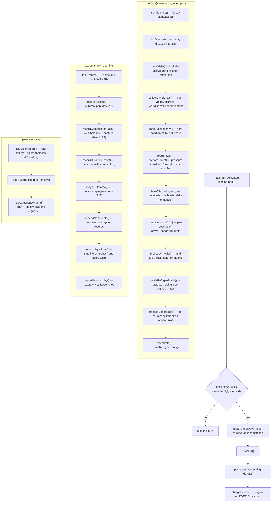

### A2. Departure state machine (pressure → bar → move)

Each ranked source is processed in prosperity order. With `splitTracksEnabled(true)` a settlement
runs a **voluntary** track and a **crisis** track concurrently, each with its own budget
(`splitBudgetsEnabled(true)`) — plus the attrition outlet (A7).

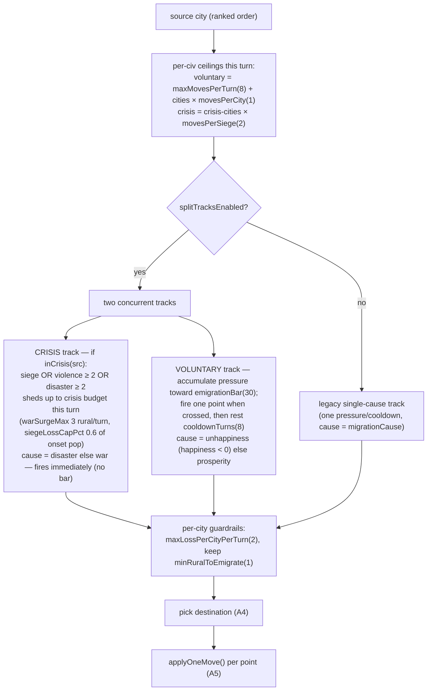

### A3. Cause determination (why people leave)

One cause per move, chosen by priority (`migrationCause` in
[../ui/emigration-pull.js](../ui/emigration-pull.js); with split tracks the crisis/voluntary split
mirrors this). Crisis causes (`war`, `disaster`, `conquest`) are *refugee* movement; `unhappiness`
and `prosperity` are *voluntary*; `attrition` (A7) and `return` (A8) are separate outlets.

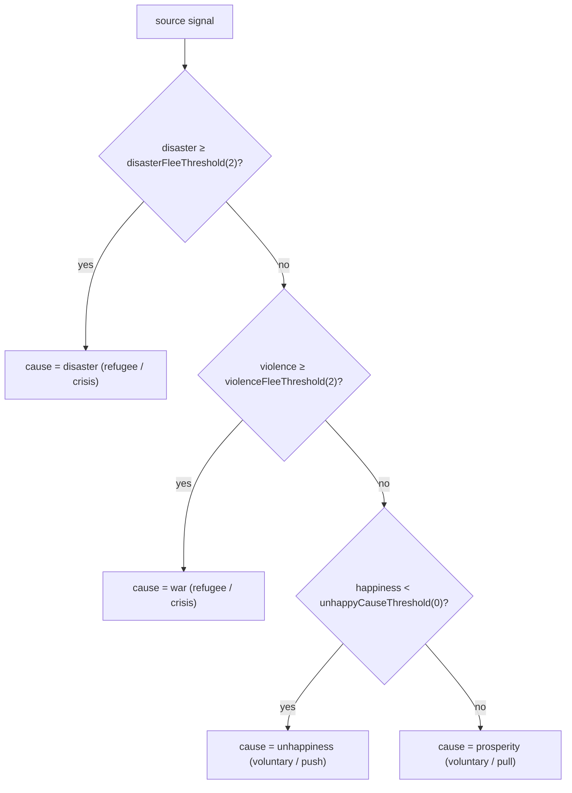

### A4. Destination selection (where they go)

`bestDestination` scores every candidate as `(gradient + tilt − friction) × permeability` and picks
the max. A candidate is dropped the moment any hard gate fails.

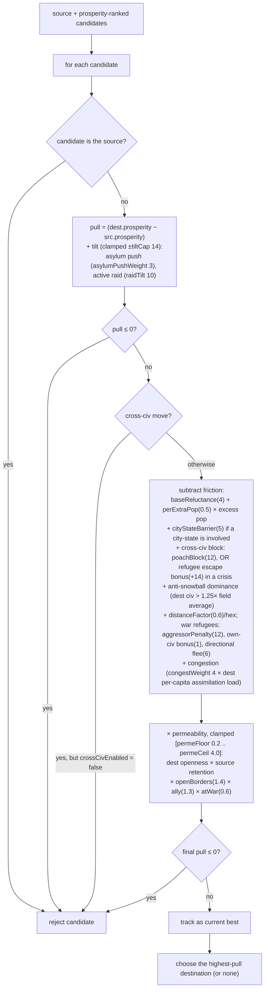

Border openness (`bordersEnabled(true)`): Closed Borders cut a civ's immigration to
`closedBordersOpenness(0.4)` and keep `closedBordersRetention(0.6)` of its own would-be emigrants
home; Open Borders lift immigration pull to `openBordersOpenness(1.5)`. Unmet civs are still
simulated (`requireMet false`); hiding them is a UI-only concern (governance), not a routing gate.

### A5. Applying one move (per rural point)

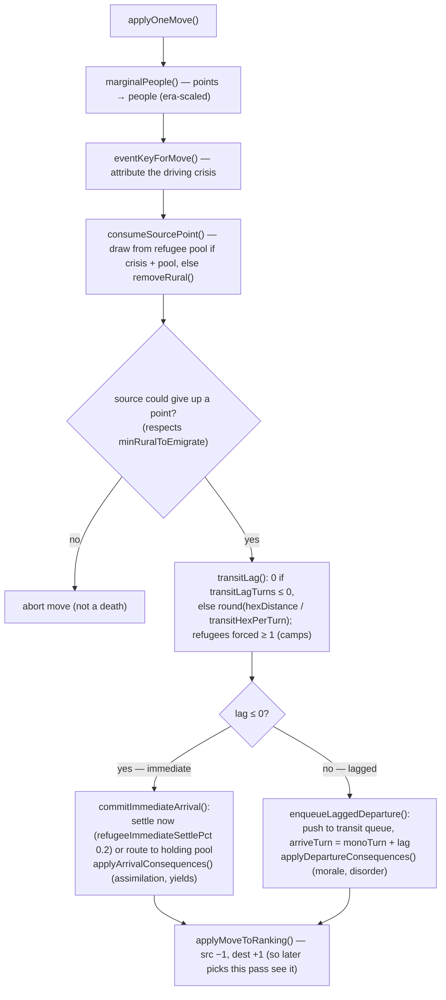

### A6. Migration queues

**Transit queue** — lagged moves in flight. Landed each pass by `processArrivals()` (longest-waiting
first, for fairness). This is a source of deaths (see A7).

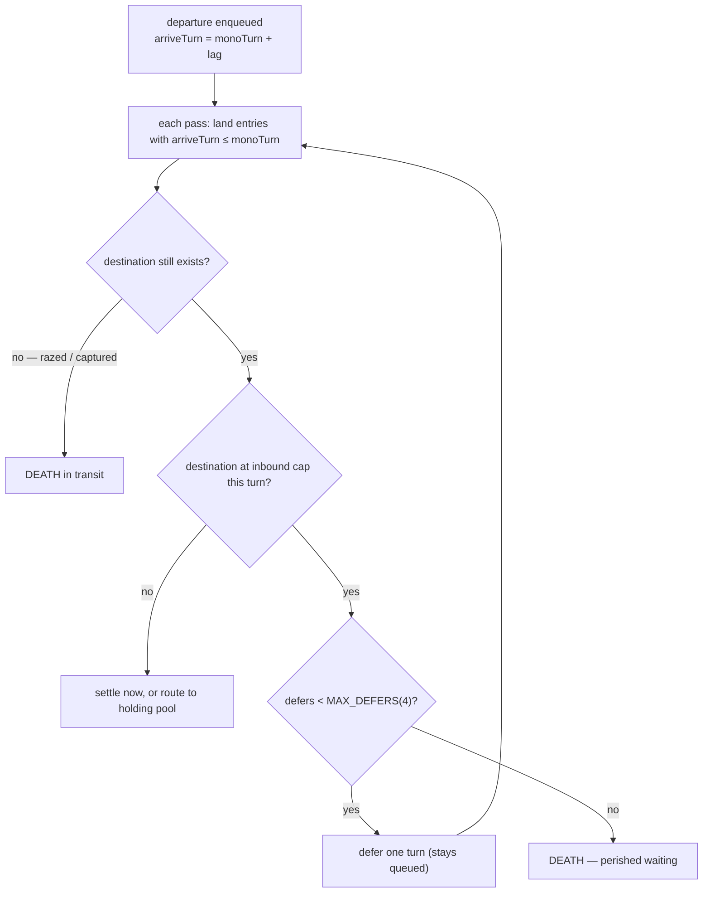

**Refugee holding pool** — per host city, when `refugeePoolEnabled(true)`. Arrivals that don't settle
immediately wait here, then trickle into the city as capacity allows.

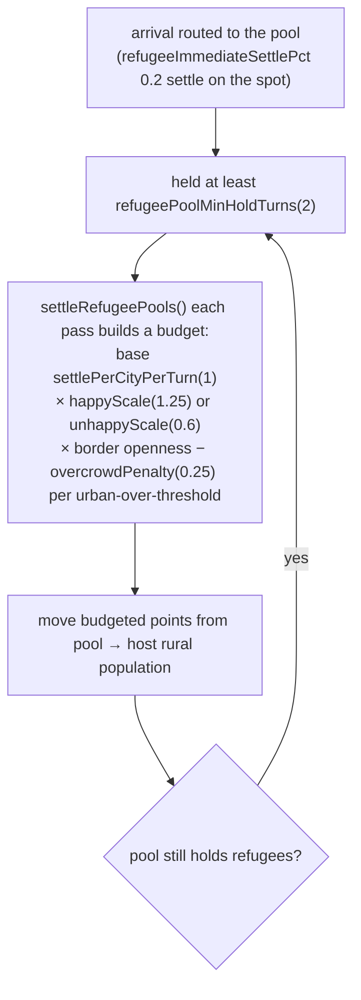

### A7. Deaths (population that leaves the world)

Not every departure relocates — some people die. Death paths:

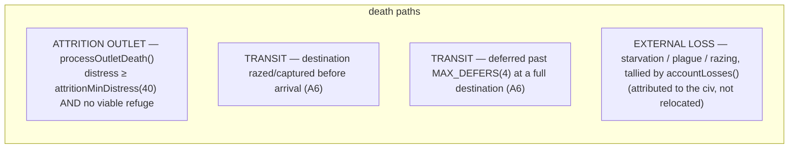

**Attrition outlet + death-ramp onset.** When a settlement is in lethal distress and has nowhere to
flee, deaths accrue as *pressure* and fire one point at a time — but the onset is smoothed so a fresh
crisis is never instantly devastating.

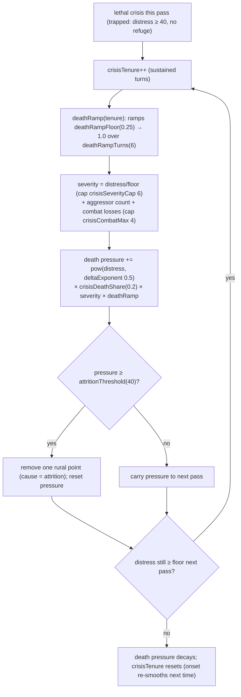

### A8. Return migration (homeland pull-back)

`planReturns()` in [../ui/emigration-return.js](../ui/emigration-return.js). A recovered, peaceful
homeland draws its diaspora back — real population moves from the host city to a homeland city. It is
naturally suppressed during crises because the homeland must be prospering and at peace.

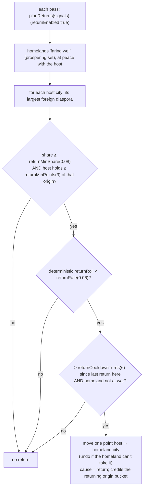

### A9. Composition + integration (who lives where)

`recordCompositionPass()` in [../ui/emigration-composition.js](../ui/emigration-composition.js)
keeps per-city origin buckets (keyed by center plot, stable across conquest).

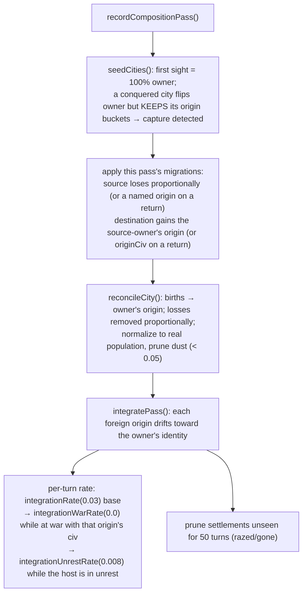

### A10. Diaspora milestones + narrative quarters

Chronicle "founding" lines fire as a foreign community grows. The **self-origin safeguard** means a
city's own founding stock never triggers a "diaspora" line. "Quarters" *here* are truthful location
*phrases* drawn from the city's real map features ([../ui/emigration-quarter-phrases.js](../ui/emigration-quarter-phrases.js)),
not a game mechanic. The actual district feature (a per-tile decision with yields and contested
war-strain) is separate; see §A13.

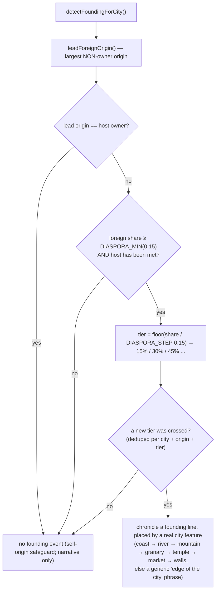

A separate detector logs **exoduses**: a war/disaster/conquest/attrition wave of ≥ 70,000 scaled
people from one settlement in a pass (one entry per 8-turn bucket per settlement + cause).

### A11. Dividend and dilemma

**Attraction dividend** — a decaying per-immigrant yield bonus for civs running an Attraction card
([../ui/emigration-dividend.js](../ui/emigration-dividend.js)).

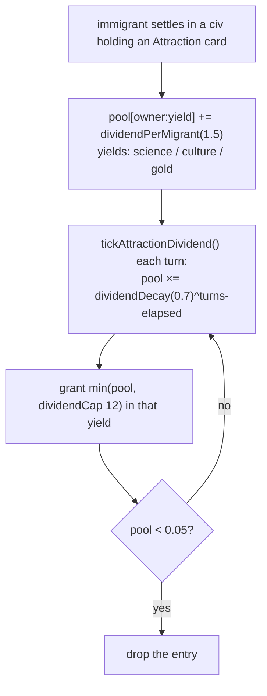

**Refugee dilemma** — a rare modal choice ([../ui/emigration-dilemma.js](../ui/emigration-dilemma.js)),
throttled hard so it stays special.

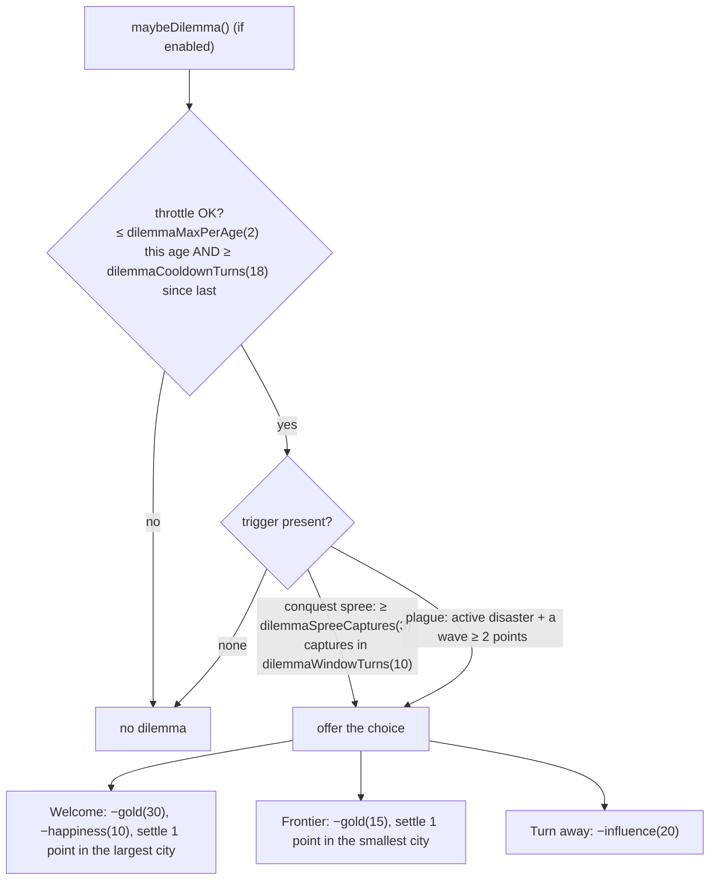

### A12. Assimilation cost (the receiving-side price)

Absorbing migrants is not free — the destination civ carries a decaying *load* that drains yields and
softens further pull ([../ui/emigration-effects.js](../ui/emigration-effects.js)).

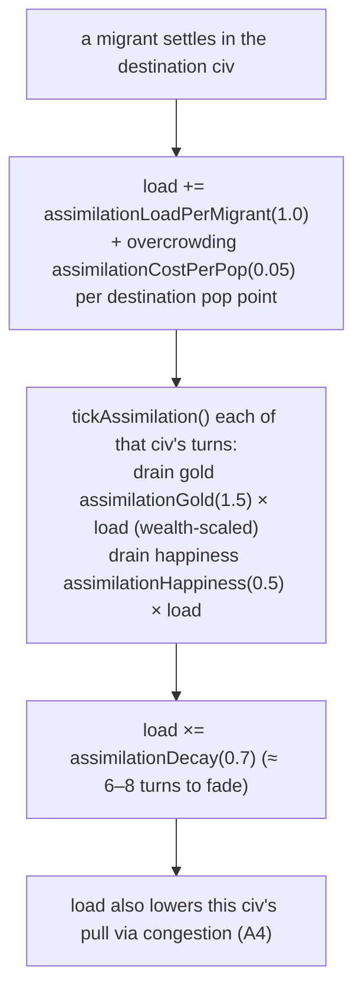

### A13. Cultural quarters (the district feature)

Distinct from the narrative phrasing in §A10: when an established foreign diaspora reads as a "quarter"
in one of the local player's cities, the mod offers a one-time stance choice and tracks a durable
per-city-tile district ([../ui/emigration-quarter.js](../ui/emigration-quarter.js), state in
[../ui/emigration-quarter-state.js](../ui/emigration-quarter-state.js)). Gated by `quartersEnabled`,
throttled by `quarterCapPerAge(3)` + `quarterCooldownTurns(12)`, and ranked below the refugee dilemma
so two modals never race. It assumes no callable native-revolt trigger; war just makes a quarter
"contested".

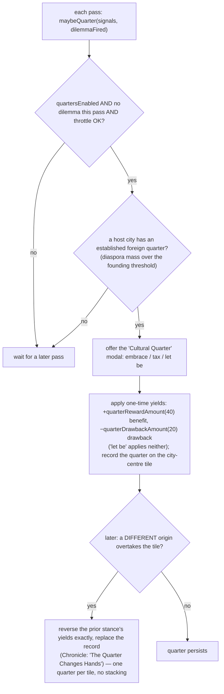

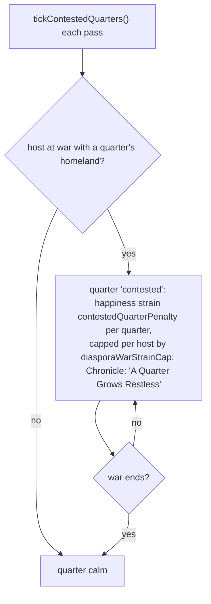

---

## Part B — Migration flow diagrams (people movement)

Flow legend: `-->` active flow this turn; `-.->` blocked/suppressed/weak route; edge labels name the
dominant cause and the mechanic behind it.

### B1. Baseline topology

Internal (same-civ) moves are cheapest; cross-border moves are candidates that must clear the pull
gates in A4.

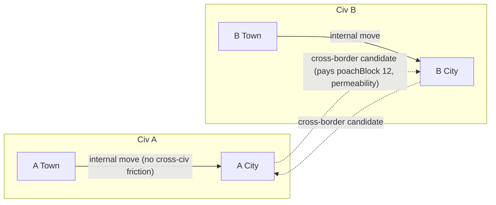

### B2. Prosperity / unhappiness (voluntary)

Voluntary movers accumulate pressure to `emigrationBar(30)`, then fire and rest `cooldownTurns(8)`.
Direction follows the prosperity gradient after friction; a small reverse trickle is normal.

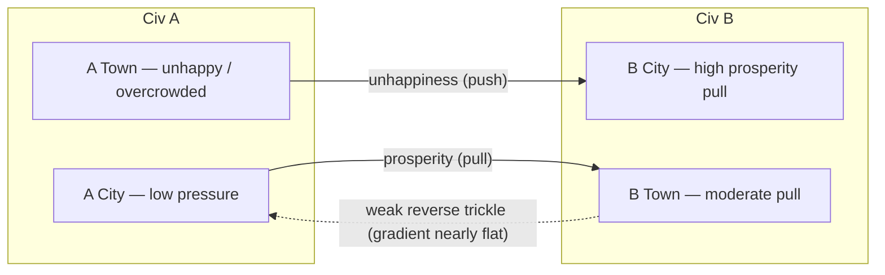

### B3. War / disaster (crisis)

There is **no scripted wave router** — the "defender first, then neighbors" pattern *emerges* from
destination ranking (A4): war refugees get an own-civ bonus (`ownCivRefugeeBonus 1`), avoid the
aggressor (`aggressorPenalty 12`), take a directional flee bonus away from the front
(`fleeFactor 6`), and pay no cross-civ block (`crisisEscapeBonus +14`). Per-turn shedding is capped
(`warSurgeMax 3`, `siegeLossCapPct 0.6`), so a crisis spreads population over several turns.

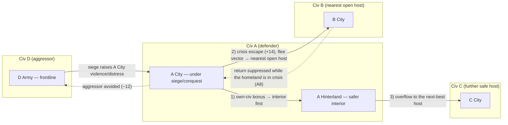

Trapped population (no viable host, distress ≥ 40) does not relocate — it dies through the attrition
outlet with a smoothed onset (A7). A conquered city keeps its residents' origins; the conqueror
absorbs the surviving population (`conquestMigrationEnabled`), while a share of rural pop
(`refugeesPercent 50`) flees as refugees.

### B4. Return migration (homeland pull-back)

```mermaid
flowchart LR
   subgraph HOSTS["Host side"]
      BCity["B City — foreign diaspora present"]
      BTown["B Town — foreign diaspora present"]
   end
   subgraph HOME["Recovered homeland (Civ A) — prospering, at peace"]
      ACity["A City"]
      ATown["A Town"]
   end
   BCity -->|"return wave (share ≥ 0.08, ≥ 3 pts, rate 0.06)"| ACity
   BTown -->|"return wave"| ATown
   BCity -.->|"residual stayers remain (integrating toward host)"| BTown
```

### B5. Policy-gated reroute (borders)

Closed/anti-immigration borders throttle a route (permeability floor `0.2`, openness `0.4`); movers
reroute to an open/pro civ (`openBordersOpenness 1.5`, `permOpenBorders 1.4`).

```mermaid
flowchart LR
   subgraph CIVA["Civ A (source)"]
      ACity["A City"]
      ATown["A Town"]
   end
   subgraph CIVB["Civ B (Closed Borders)"]
      BCity["B City"]
   end
   subgraph CIVC["Civ C (Open Borders)"]
      CCity["C City"]
   end
   ACity -.->|"throttled by low permeability (openness 0.4)"| BCity
   ATown -.->|"emigration retained at home (retention 0.6)"| BCity
   ACity -->|"reroute: prosperity + open-border pull"| CCity
   ATown -->|"reroute"| CCity
```

### B6. Competitive hub (anti-snowball)

Several sources feed one attractive civ; as that civ grows past `1.25×` the field average, the
anti-snowball penalty and congestion (rising assimilation load) bend later movers toward its towns or
elsewhere, so no single magnet runs away with the world.

```mermaid
flowchart LR
   subgraph SRC["Sources"]
      ACity["A City"]
      CCity["C City"]
      DTown["D Town"]
   end
   subgraph HUB["Civ B hub"]
      BCity["B City — high pull"]
      BTown["B Town — spillover"]
   end
   ACity -->|"prosperity"| BCity
   CCity -->|"war (crisis escape)"| BCity
   DTown -->|"unhappiness"| BTown
   BCity -.->|"anti-snowball + congestion (assimilation load) redirect"| BTown
```
